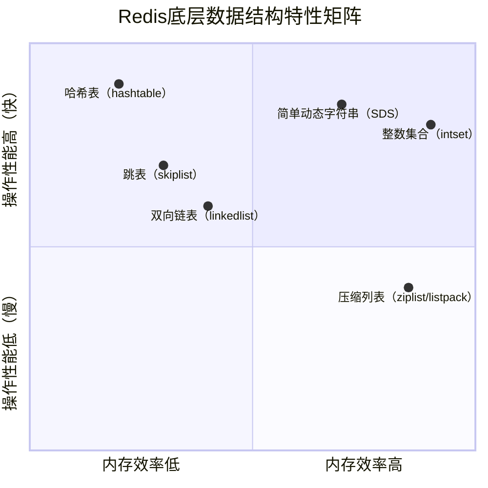
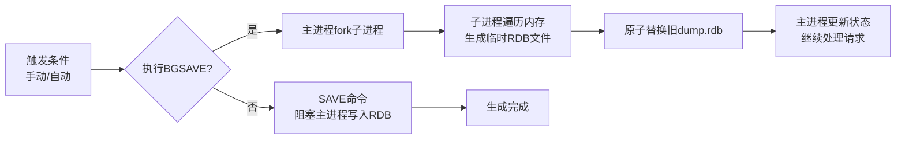
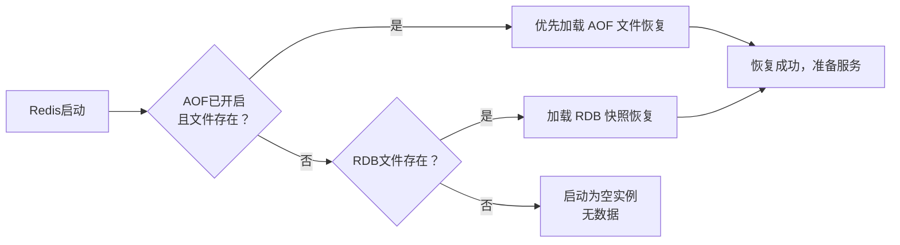
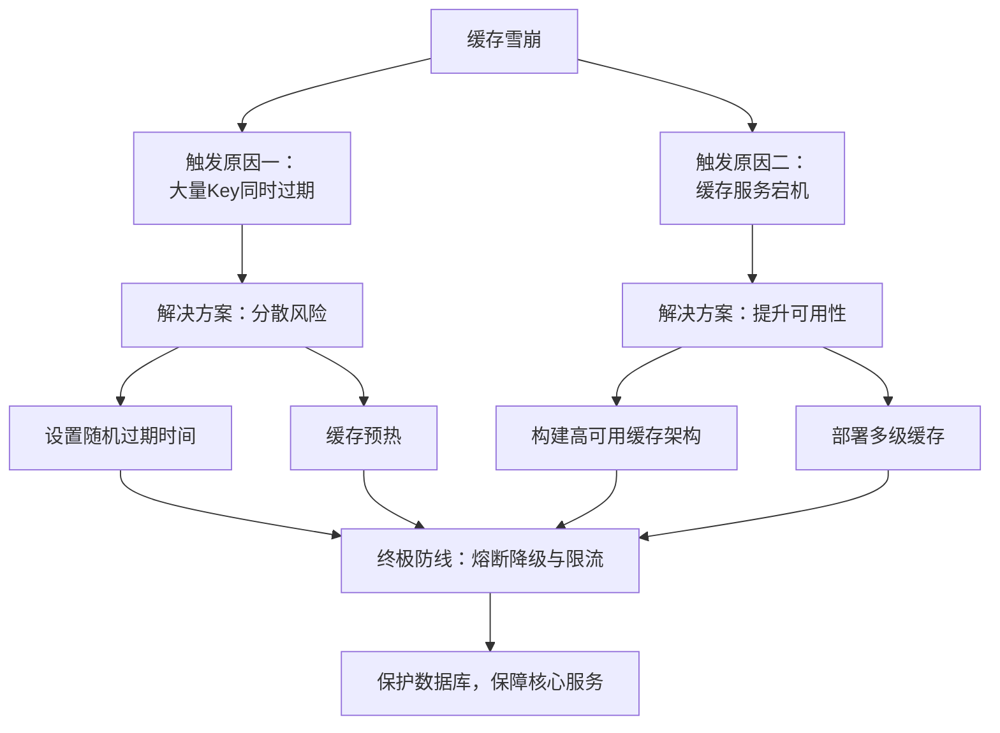
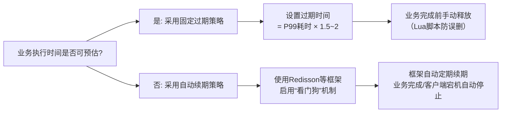
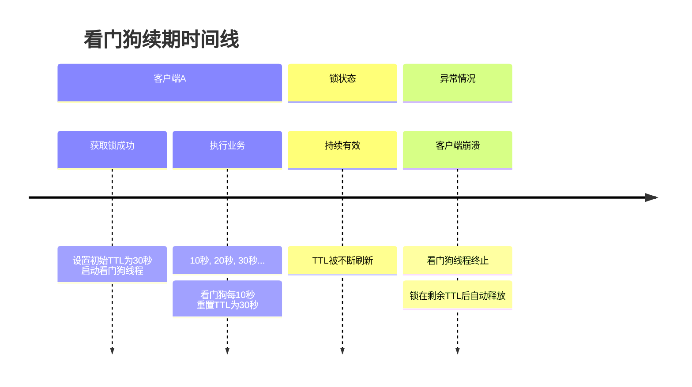
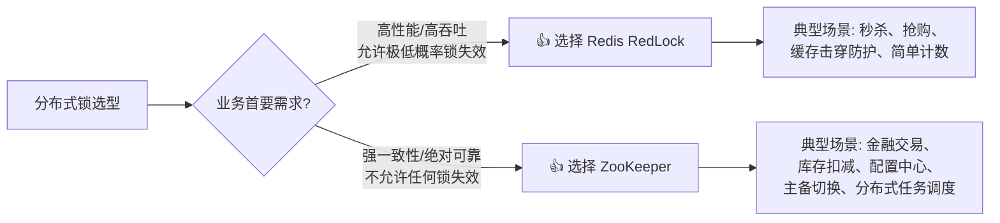

# Redis

## 基础

### Redis的作用

Redis是一个开源的、**基于内存的键值对存储系统**，以其**高性能、低延迟**和**丰富的数据结构**而闻名。它广泛应用于各类需要快速数据处理、高并发和实时性的场景，是现代互联网应用，尤其是支持高并发访问的互联网应用必不可少的基础服务之一。

1. **高性能缓存与会话管理**

这是Redis最经典、最广泛的应用。

+ **热点数据缓存**：将数据库中频繁访问的“热点数据”（如商品详情、用户信息、配置参数）存储在Redis内存中。当请求到达时，先查询Redis，命中则直接返回，极大减轻数据库的查询压力和磁盘I/O，提高系统响应速度。Redis的读速度可达约110,000次/秒。
+ **分布式会话管理**：在分布式系统（如使用负载均衡的Web应用）中，将用户会话信息存储在Redis中。所有服务器都从Redis读取/写入会话，解决了会话状态无法跨服务器共享的问题，是实现无状态应用架构的关键。
+ **全页缓存**：直接缓存整个渲染好的页面HTML，减少数据库查询和页面渲染时间，显著提升页面加载速度

2. **实时功能与数据处理**（排行榜计数器）

Redis的操作多为原子性，且完全在内存中执行，非常适合构建实时功能。

+ **排行榜与计数器：**

  - **计数器**：利用Redis的原子性`INCR`/`DECR`命令，可以高效统计网页浏览量、文章点赞数、评论数等。

  - **排行榜**：使用Redis的**有序集合(Sorted Set)** 数据结构，可以轻松实现按分数（如点击量、积分）排序的排行榜功能，如游戏积分榜、热门文章排行。

+ **消息队列：**

  - 利用Redis的**列表(List)** 数据结构，可以构建一个简单的FIFO（先进先出）队列，用于异步任务处理、订单处理等。

  - 利用Redis的**发布/订阅(Pub/Sub)** 模式，可以实现消息的实时广播，适用于实时聊天、通知推送等场景。

+ **实时分析**：结合HyperLogLog等数据结构，可以进行实时用户行为统计（如日活、月活）、实时数据分析等。

3. **分布式锁**

Redis是构建分布式系统不可或缺的组件。

+ **分布式锁**：在分布式环境中，多个节点可能同时访问共享资源。Redis提供了`SETNX`（SET if Not eXists）等命令，可以方便地实现分布式锁，确保同一时刻只有一个节点能操作资源，避免竞态条件和数据不一致，常用于秒杀、库存扣减等场景。

+ **限流与访问控制**：通过Redis的过期时间和计数器功能，可以实现API调用频率限制（限流），防止系统过载。

+ **任务调度与队列**：除了作为消息队列，Redis也可以用于简单的任务调度和定时任务管理

### Redis基本的数据类型

Redis 的核心是一个键值（Key-Value）存储系统，其中 **Key 总是字符串**，而 Value 则支持多种丰富的数据类型。这些数据类型直接面向用户使用，每种类型都针对特定的应用场景进行了优化。

除了五种最常用的**基础数据类型**外，Redis 还提供了一些**高级/特殊数据类型**，以满足更专业的统计和计算需求。下面的思维导图清晰地展示了Redis的数据类型全貌：

#### 基础数据类型

| 数据类型            | 核心特点                                                     | 常用命令示例                               | 典型应用场景                                                 |
| :------------------ | :----------------------------------------------------------- | :----------------------------------------- | :----------------------------------------------------------- |
| **String (字符串)** | 最基本的类型，**二进制安全**，可存储任意数据（文本、数字、图片等），最大512MB。 | `SET`, `GET`, `INCR`, `APPEND`             | **缓存**用户信息、商品详情；**计数器**（点赞、访问量）；**分布式锁**（结合`SETNX`）。 |
| **Hash (哈希)**     | 键值对集合，**适合存储对象**。一个Key对应多个field-values。  | `HSET`, `HGET`, `HGETALL`, `HDEL`          | **存储用户信息**（如 `user:1001` 包含 `name`, `age` 等字段），相比序列化整个对象，**更节省内存且支持部分更新**。 |
| **List (列表)**     | **有序**的字符串链表，支持从两端进行插入和弹出操作。         | `LPUSH`, `RPUSH`, `LPOP`, `RPOP`, `LRANGE` | **消息队列**（`LPUSH` + `BRPOP`）；**最新列表**（如朋友圈时间线）；**简单栈**（`LPUSH` + `LPOP`）。 |
| **Set (集合)**      | **无序、不重复**的元素集合，支持集合间的数学运算（交集、并集、差集）。 | `SADD`, `SREM`, `SISMEMBER`, `SINTER`      | **标签系统**；**共同好友**（交集）；**去重**；**随机抽奖**（`SPOP`）。 |
| **ZSet (有序集合)** | 在集合基础上为每个元素关联一个**分数(Score)**，按分数自动排序。 | `ZADD`, `ZRANGE`, `ZRANK`, `ZSCORE`        | **排行榜**（游戏积分、热搜榜）；**延迟队列**（按执行时间排序）；**带权重的范围查询**。 |

#### 高级数据类型

| 数据类型           | 核心特点                                               | 典型应用场景                                                 |
| :----------------- | :----------------------------------------------------- | :----------------------------------------------------------- |
| **Bitmaps (位图)** | 基于String的位操作，每个bit位代表一个独立状态。        | **用户签到**（每天一个bit）；**在线状态**统计；**布隆过滤器**基础。 |
| **HyperLogLog**    | 概率性数据结构，用于**基数统计**（估算唯一元素数量）。 | **网站UV统计**；**去重计数**。内存占用极低（12KB即可统计2^64个唯一值）。 |
| **Geo (地理空间)** | 基于ZSet，用于存储和查询地理空间信息。                 | **“附近的人”**；**计算两地距离**；**地图选址**。             |
| **Stream (流)**    | Redis 5.0新增的**持久化消息队列**，支持消费组功能。    | **比List更可靠的消息队列**；**事件流处理**；**日志系统**。   |

#### 底层数据结构



**跳表**：

跳表（Skip List）是一种基于有序链表的高效数据结构，它通过**增加多级索引**来实现快速查找、插入和删除，平均时间复杂度为 **O(log n)**。其核心思想是“**空间换时间**”，并使用**随机化算法**来维护索引的平衡性，从而避免了平衡树（如红黑树）中复杂的旋转操作。

**🔧 核心原理：从链表到跳表**

普通有序链表的查找、插入、删除时间复杂度都是 **O(n)**，效率低下。跳表在链表的基础上建立了多级索引层，从而大幅提升操作效率。

1. **多级索引结构**：跳表由多层有序链表组成。最底层（第0层）包含所有元素，每一层都是其下一层的“快速通道”或“子集”，越往上的层节点越稀疏。查找时，先在高层快速定位大致范围，再逐层向下精确查找，类似于二分查找。
2. **随机层数生成**：新插入节点的层数由随机算法决定（如“抛硬币”）。以概率 `p`（常取0.25或0.5）决定是否晋升到上一层，直到失败或达到最大层数。这种随机化机制确保了索引的平衡性，避免了像平衡树那样复杂的再平衡操作。

**⚙️ 核心操作流程**

**1. 查找**

从最高层头节点开始。在当前层向右查找，直到下一个节点的值大于等于目标值，然后下降到下一层继续查找。重复此过程，直到在底层找到目标或确定不存在.

**2. 插入**

+ **查找位置**：通过查找算法，确定新节点在每层的前驱节点，并记录下来。
+ **随机决定层数**：调用随机函数生成新节点的层数 `k`。
+ **创建并插入节点**：创建新节点，并在其 `k` 层分别插入到对应的前驱节点之后，更新相关指针。

**3. 删除**

+ **查找节点**：找到目标节点及其在每一层的前驱节点。
+ **逐层移除**：从最高层开始，逐层将前驱节点的指针指向目标节点的后继节点，从而将目标节点从各层链表中移除。
+ **释放节点**：最后释放目标节点的内存。

尽管跳表与平衡树（如红黑树、AVL树）在平均时间复杂度上相当，但它在实际工程中有独特优势：

1. **实现简单**：跳表的实现远比红黑树简洁（通常只需100-200行代码），无需复杂的旋转和颜色维护逻辑，更易于理解和调试。
2. **范围查询高效**：跳表底层是有序链表，完成区间端点定位后，可直接顺序遍历链表获取范围内所有元素，非常高效。而平衡树的范围查询需要通过中序遍历，实现更复杂。
3. **并发性能好**：由于其分层结构，跳表更容易实现细粒度的并发控制（如无锁数据结构），在高并发场景下表现更优。
4. **内存友好**：虽然跳表需要额外空间存储索引，但节点结构简单，实际内存开销可控，且对缓存行更友好。

### Redis为什么快

Redis 的极致性能（单机可达 **10万+ QPS**）是多项精妙设计共同作用的结果。其核心思想可概括为：**以内存为核心，通过单线程与高效I/O模型规避并发开销，并借助专门优化的数据结构实现极致操作效率**。

**1. 基于内存的存储：速度的根本保障**

Redis 将所有数据存储在内存中，这是它速度快的最根本原因。内存的访问速度是纳秒级，而传统磁盘数据库是毫秒级，两者存在**几个数量级**的性能差距。所有的数据操作都直接在 RAM 中进行，避免了磁盘 I/O 带来的寻道、旋转等巨大开销。

**2. 单线程事件循环模型：规避并发开销**

Redis 处理客户端命令的核心是一个单线程事件循环（Reactor 模式）。这种设计带来三大优势：

- **无锁竞争**：单线程顺序执行所有命令，避免了多线程下的锁竞争、死锁及加锁/解锁的性能开销。
- **无上下文切换**：避免了线程频繁切换带来的CPU时间浪费。
- **天然原子性**：每个Redis命令都是原子操作，保证了数据一致性。

> 💡 **注意**：Redis 6.0 引入的多线程仅用于**网络I/O的读写**，核心的命令执行仍然是单线程，以保证操作的原子性和一致性。

**3. I/O多路复用技术：高并发的利器**

Redis 使用操作系统的 **I/O多路复用** 技术来实现单线程处理高并发连接。它通过 `epoll`（Linux）、`kqueue`（BSD）等系统调用，让一个线程能同时监听多个客户端的 Socket 文件描述符。

**工作原理**：当某个 Socket 有数据可读或可写时，操作系统会通知 Redis 进行处理，而非阻塞等待。这避免了为每个连接创建线程的传统模型的高资源消耗。

**4. 高度优化的底层数据结构**

Redis 针对不同数据场景，设计了多种高效的底层数据结构，是其高性能的核心

| 数据结构                 | 优化点                           | 提升性能的方式                                               |
| :----------------------- | :------------------------------- | :----------------------------------------------------------- |
| **SDS (简单动态字符串)** | 记录长度、空间预分配、二进制安全 | **O(1)** 复杂度获取长度，减少内存重分配次数，防止缓冲区溢出。 |
| **压缩列表 / 紧凑列表**  | 连续内存块、紧凑存储小数据       | 节省内存，对 CPU 缓存友好。适用于 List、Hash、ZSet 等数据量小的场景。 |
| **跳表 (SkipList)**      | 多级索引、随机层数               | 为 ZSet 提供 **O(logN)** 的插入、删除、范围查询性能，实现高效排行榜。 |
| **字典 (Dict)**          | 哈希表 + 链表、**渐进式 rehash** | 大多数操作 **O(1)**。渐进式 rehash 将数据迁移分散到多次请求中，避免阻塞主线程。 |
| **整数集合**             | 有序数组、类型自动升级           | 存储纯整数 Set 的极致紧凑结构，节省内存。                    |

### I/O多路复用

在网络编程中，**I/O 指的是网络数据的输入和输出**。
一个完整的网络 I/O 操作包含两个阶段：

1. **等待数据准备阶段**：等待网络上的数据包到达网卡，并被复制到内核的缓冲区中。（**这个阶段大多是阻塞的、耗时的**）
2. **复制数据阶段**：将数据从内核缓冲区复制到用户空间（应用程序的内存）中。

**I/O 多路复用** 是 Redis 能够在单线程下处理海量并发连接的**最核心技术**。

**“多路”**：指的是多个网络连接（Socket）。
**“复用”**：指的是**复用同一个线程**来处理这些连接。

**核心思想**：**把“等待数据到达”这件事，交给操作系统去干！**

在 I/O 多路复用模型下，应用程序不再挨个去问 Socket，而是调用操作系统的提供的**多路复用函数**（如 Linux 下的 `epoll`），对操作系统说：

> “老大，我这里有 10,000 个 Socket，你帮我盯着。**哪个 Socket 有数据来了，你告诉我一声**，我再去做处理。在这期间，我去干点别的事（或者干脆睡眠）。”

当操作系统发现有数据到达时，就会唤醒应用程序，并**精确地告诉它**：“第 5 号和第 88 号 Socket 有数据了，你处理一下。” 此时应用程序再去读取数据，就绝对不会阻塞了。

**操作系统的三种多路复用实现**

I/O 多路复用是操作系统级别的支持，Redis 根据不同的操作系统，使用了不同的底层实现：

| 实现技术   | 支持系统     | 工作原理                                                     | 性能/特点                                                    |
| :--------- | :----------- | :----------------------------------------------------------- | :----------------------------------------------------------- |
| **select** | 几乎所有系统 | 把要监听的 Socket 集合**拷贝进内核**，内核遍历这个集合检查事件。 | 性能差。有连接数上限（通常 1024），每次都要拷贝数据，内核需要遍历全量集合。 |
| **poll**   | 几乎所有系统 | 原理同 select，但改用链表存储，**突破了 1024 的数量限制**。  | 性能依然差。依然存在数据拷贝和 O(N) 的遍历问题。             |
| **epoll**  | Linux        | **事件驱动机制**。应用程序向 epoll 注册 Socket，内核维护一棵红黑树。当某个 Socket 有事件发生时，内核通过回调函数将其加入“就绪队列”，应用程序只需读取就绪队列。 | **极致性能**。无连接数限制；不需要每次拷贝全量数据；时间复杂度 **O(1)**（只处理活跃的连接）。 |


## 持久化

### RDB

Redis的 **RDB持久化** 是一种将内存中的数据集以**时间点快照**形式保存到磁盘的二进制文件机制。它通过生成一个紧凑的 `dump.rdb` 文件，实现了数据的快速备份与恢复。



RDB文件本质上是Redis在某一时刻内存数据的**完整二进制快照**。其生成主要有两种触发方式：

| 触发方式     | 命令/条件              | 特点                                                         | 适用场景                           |
| :----------- | :--------------------- | :----------------------------------------------------------- | :--------------------------------- |
| **手动触发** | `SAVE`                 | 同步阻塞Redis主进程，直到快照完成。                          | 生产环境**慎用**，会导致服务暂停。 |
|              | `BGSAVE`               | 异步执行，通过 `fork()` 创建子进程完成写入，父进程继续处理请求。 | **生产环境推荐**。                 |
| **自动触发** | 配置文件中 `save` 规则 | 在指定时间（秒）内发生指定次数的写操作时，自动触发 `BGSAVE`。 | 实现周期性备份。                   |

**自动触发配置示例**（在 `redis.conf` 中）：

```
save 900 1     # 900秒内至少有1个key被修改
save 300 10    # 300秒内至少有10个key被修改
save 60 10000  # 60秒内至少有10000个key被修改
```

满足任一条件即会触发持久化。其他如执行 `SHUTDOWN` 命令（未开启AOF时）或主从复制全量同步也会自动触发 `BGSAVE`。

**⚙️ BGSAVE背后的关键技术：写时复制（COW）**

`BGSAVE` 的非阻塞特性依赖于操作系统的**写时复制（Copy-On-Write, COW）** 技术。

1. **`fork()` 子进程**：主进程调用 `fork()`，创建一个子进程。此时，子进程与父进程**共享相同的内存页**。
2. **内存页共享**：子进程开始将共享的内存数据写入临时的RDB文件。
3. **按需复制**：在子进程写入期间，如果父进程（继续处理客户端请求）**修改了某个内存页**，操作系统会**为被修改的内存页创建一个副本**。这样，子进程始终看到的是 `fork()` 那一刻的“快照”数据，而父进程的修改互不干扰。
4. **完成替换**：子进程写入完成后，会**原子地**用新文件替换旧的 `dump.rdb` 文件。

> ⚠️ **注意**：`fork()` 操作本身在数据集很大时可能会耗时数百毫秒，导致服务短暂停顿。同时，在持久化期间如果有大量写操作，可能会导致内存占用峰值达到原来的两倍。

**🛑 `SAVE` 命令的本质：同步阻塞**

当你向 Redis 发送 `SAVE` 命令时，Redis 服务器会做以下事情：

1. **完全停止工作**：Redis 主线程**立刻拒绝**所有新的客户端连接和命令请求（阻塞）。
2. **直接写磁盘**：由主线程亲自遍历当前内存中的所有数据，将其转换成二进制格式，并直接写入到 `dump.rdb` 文件中。
3. **恢复服务**：直到整个文件写入完毕，Redis 才会解除阻塞，恢复对外提供服务。

### AOF

Redis 的 **AOF（Append Only File）** 持久化机制，通过**记录所有写命令**来实现数据恢复，是一种以日志形式追加、保证数据安全性的核心方案。

**🔧 工作原理：命令追加、刷盘与重写**

AOF 的完整工作流程分为三个核心步骤：

1. **命令追加**：当 AOF 功能开启后，Redis 服务器每执行完一个**写命令**，都会将这条命令以 Redis 协议格式追加到服务器的 `aof_buf` 缓冲区末尾。
2. **文件写入与同步**：Redis 根据 `appendfsync` 配置的策略，将缓冲区中的内容写入并同步到磁盘上的 AOF 文件。这是在**写入性能**和**数据安全**之间做权衡的关键。
3. **AOF 重写**：随着时间推移，AOF 文件会越来越大。Redis 会通过创建一个新的、包含重建当前数据集所需**最少命令**的 AOF 文件来压缩体积，这个过程称为“重写”。

**⚙️ 核心配置：开启与刷盘策略**

在 `redis.conf` 中配置是使用 AOF 的第一步。

| 配置项                            | 说明                             | 推荐值             |
| :-------------------------------- | :------------------------------- | :----------------- |
| **`appendonly`**                  | **开启 AOF 功能**（默认为 `no`） | `yes`              |
| **`appendfilename`**              | 设置 AOF 文件名                  | `"appendonly.aof"` |
| **`appendfsync`**                 | **刷盘策略，平衡性能与安全**     | `everysec`         |
| **`auto-aof-rewrite-percentage`** | AOF 文件增长百分比触发重写       | `100`              |
| **`auto-aof-rewrite-min-size`**   | AOF 文件最小重写大小             | `64mb`             |

**刷盘策略 `appendfsync` 是最关键的配置**，它决定了数据丢失的风险：

| 策略                   | 说明                                 | 数据安全性                             | 性能影响                             | 适用场景                                 |
| :--------------------- | :----------------------------------- | :------------------------------------- | :----------------------------------- | :--------------------------------------- |
| **`always`**           | 每个写命令都**立即同步**到磁盘。     | **最高**，最多丢失一个事件循环的命令。 | **最低**，严重影响性能。             | 对数据一致性要求极高的场景，如金融交易。 |
| **`everysec`**（默认） | **每秒**同步一次（由后台线程执行）。 | **较高**，最多丢失 **1秒** 内的数据。  | **平衡**，是生产环境的推荐选择。     | 常规业务系统，在性能和安全间取得平衡。   |
| **`no`**               | 交给操作系统决定何时同步。           | **最低**，可能丢失大量数据（如30秒）。 | **最高**，Redis 不主动调用 `fsync`。 | 不在乎数据安全的非关键场景。             |

**📦 AOF 重写机制：解决文件膨胀**

AOF 文件会随着操作不断增大，重写机制能有效压缩文件。

- 触发方式：
  - **自动触发**：当 AOF 文件大小同时满足 `auto-aof-rewrite-percentage`（增长比例）和 `auto-aof-rewrite-min-size`（最小大小）条件时自动触发。
  - **手动触发**：执行 `BGREWRITEAOF` 命令。
- 重写原理：
  1. Redis 主进程 **`fork()`** 一个子进程来执行重写，主进程继续处理客户端请求。
  2. 子进程遍历当前数据库，将每个键的**当前状态**用一条或几条命令写入一个**新的临时 AOF 文件**。
  3. 在此期间，主进程的新写命令会同时追加到 **AOF 重写缓冲区**。
  4. 子进程重写完成后，主进程将重写缓冲区中的命令追加到新文件，然后用新文件**原子地替换**旧的 AOF 文件

### 🆚 AOF vs. RDB：如何选择？

**AOF与RDB的区别**

RDB 和 AOF 是 Redis 提供的两种截然不同的持久化思想：**RDB 是“照相机”（拍快照），AOF 是“录像机”（记日志）**。

| 维度         | RDB (Redis Database)                                         | AOF (Append Only File)                                       |
| :----------- | :----------------------------------------------------------- | :----------------------------------------------------------- |
| **核心思想** | **全量快照**：把某一时刻内存里的所有数据，拍一张照片存下来。 | **增量日志**：把你执行的所有写命令（如 SET、DEL），按顺序记在账本上。 |
| **文件格式** | **二进制**文件，经过压缩，人类无法直接阅读。                 | **文本**文件（类 Redis 协议格式），可以直接用 Vim 查看。     |
| **文件体积** | **非常小**（二进制紧凑存储）。                               | **比较大**（即使有重写机制，通常也比 RDB 大）。              |

**性能与安全对比（最核心的取舍）**

这是在实际架构选型中最需要关注的点：

| 维度                  | RDB                                                        | AOF                                                          |
| :-------------------- | :--------------------------------------------------------- | :----------------------------------------------------------- |
| **数据安全性**        | **低**。如果宕机，会丢失上次快照之后到宕机期间的所有数据。 | **高**。默认（`everysec`）最多丢失 1 秒数据；配置为 `always` 理论上最多丢失一条命令。 |
| **对 Redis 性能影响** | **极低**。把备份工作丢给子进程，主线程完全不管。           | **较高**。主线程需要将命令写入缓冲区并根据策略刷盘，`always` 模式会严重拖慢性能。 |
| **恢复速度**          | **极快**。直接把二进制文件读入内存，几 GB 的数据秒级恢复。 | **慢**。需要逐条解析命令并执行，重建数据集，速度远慢于 RDB。 |

当同时开启时，Redis **优先使用 AOF 文件**来恢复数据，因为它通常更新、更完整。两者的对比如下：

| 特性                 | AOF                                          | RDB                                                          |
| :------------------- | :------------------------------------------- | :----------------------------------------------------------- |
| **数据安全性**       | **高**，可配置为秒级或实时持久化。           | **低**，两次快照间可能丢失数分钟数据。                       |
| **文件大小**         | 较大（需重写压缩）。                         | **紧凑**，体积小。                                           |
| **恢复速度**         | **慢**，需逐条重放命令。                     | **极快**，直接加载二进制文件到内存。                         |
| **对主进程性能影响** | 较大（取决于刷盘策略）。                     | 较小（由子进程完成）。                                       |
| **适用场景**         | 对数据完整性要求高的场景，如数据库、排行榜。 | 对数据丢失容忍度较高，或需要快速备份、复制的场景，如纯缓存、灾备。 |

> 💡 **生产环境建议**：**同时开启 RDB 和 AOF**，并启用 **混合持久化**（`aof-use-rdb-preamble yes`，Redis 4.0+）。混合持久化生成的 AOF 文件前半部分是 RDB 格式的二进制数据，后半部分是 AOF 格式的增量命令，**兼顾了 RDB 的恢复速度和 AOF 的数据安全性**。

### Redis的数据恢复

Redis 数据恢复是保障数据安全的关键环节，其核心是**通过加载磁盘上的持久化文件（RDB 或 AOF）来重建内存中的数据集**。恢复过程在 Redis 启动时**自动完成**，遵循明确的优先级规则。



**📂 从不同文件恢复的具体操作**

虽然启动时会自动加载，但在需要手动干预（如从备份恢复）时，可遵循以下步骤。

**1. 从 RDB 文件恢复**

RDB 文件（默认 `dump.rdb`）是某个时间点的二进制数据快照，恢复速度快。

+ **停止 Redis 服务**：防止数据写入冲突。

```
    sudo systemctl stop redis
    # 或
    redis-cli shutdown
```

+ **备份现有文件**：安全第一，备份当前的数据文件。

```
    mkdir -p ~/redis-backup
    sudo cp /var/lib/redis/dump.rdb ~/redis-backup/
```

+ **替换 RDB 文件**：将备份的 RDB 文件复制到 Redis 配置的 `dir` 目录，并确保文件名与 `dbfilename` 配置一致（默认为 `dump.rdb`）。

```
    sudo cp /path/to/your/backup.rdb /var/lib/redis/dump.rdb
    sudo chown redis:redis /var/lib/redis/dump.rdb
```

+ **启动 Redis 服务**：Redis 会自动检测并加载该文件。

```
    sudo systemctl start redis
```

**2. 从 AOF 文件恢复**

AOF 文件（默认 `appendonly.aof`）记录了所有写操作，恢复的是命令序列。

+ **停止 Redis 服务**。

+ **备份并替换 AOF 文件**：将备份的 AOF 文件复制到 `dir` 目录，确保文件名与 `appendfilename` 配置一致。

```
    sudo cp /path/to/your/backup.aof /var/lib/redis/appendonly.aof
    sudo chown redis:redis /var/lib/redis/appendonly.aof
```

+ **（可选）检查并修复文件**：如果 AOF 文件可能损坏，可使用工具检查。

```
    redis-check-aof /var/lib/redis/appendonly.aof
```

   如果提示损坏，可以尝试修复：

```
    redis-check-aof --fix /var/lib/redis/appendonly.aof
```

+ **启动 Redis 服务**：确保 `redis.conf` 中 `appendonly yes` 已开启，Redis 将重放 AOF 中的命令。

Redis 4.0+ 支持混合持久化（`aof-use-rdb-preamble yes`）。此时的 `appendonly.aof` 文件**前半部分是 RDB 格式的二进制快照，后半部分是 AOF 格式的增量命令**。

**恢复流程**：

1. Redis 检测到 AOF 文件开头是 RDB 格式（以 `REDIS` 为前导）。
2. **先快速加载 RDB 部分**，恢复大部分数据。
3. **再重放后续的 AOF 命令**，恢复剩余增量数据。
4. 最终完成数据恢复。

这种模式**兼具了 RDB 的恢复速度和 AOF 的数据完整性**。


## 缓存

**缓存（Cache）** 是一种用于高速数据交换的临时存储区域或存储机制。它的核心原理是将频繁访问或最近使用的数据，存储在比原始数据源（如磁盘、数据库）**访问速度更快的介质**（通常是内存）中。当再次需要这些数据时，系统可以直接从缓存中快速获取，从而避免了对慢速存储的重复访问，显著提升系统性能。

在Redis等缓存系统的实际应用中，缓存设计不当会导致三种经典的异常问题：**缓存穿透**、**缓存击穿**和**缓存雪崩**

### 缓存的三种异常

#### 缓存穿透

**缓存穿透 (Cache Penetration)** 是指客户端请求查询一个**在缓存和数据库中都不存在**的数据，导致每次请求都会绕过缓存层，直接“穿透”到数据库进行查询，从而给数据库带来巨大压力的现象。

解决缓存穿透的核心思路是**在请求到达数据库前，有效拦截对不存在数据的查询**

| 方案           | 核心原理                                                     | 优点                                                         | 缺点                                                         | 适用场景                                                     |
| :------------- | :----------------------------------------------------------- | :----------------------------------------------------------- | :----------------------------------------------------------- | :----------------------------------------------------------- |
| **缓存空值**   | 当数据库查询为空时，仍将该**请求的键写入缓存**，并存储一个**带有较短过期时间的空对象/特殊标记**（如 `NULL_VALUE`）。 | ✅ 实现简单，维护方便 。               ✅ 能拦截后续相同的无效请求 | ❌ **内存消耗大**（恶意攻击会生成海量空键） ❌ 存在**短时数据不一致**（TTL内数据库新增了该数据） | 不存在的数据请求**量少**或数据变更频繁，且缓存空间充足。     |
| **布隆过滤器** | 在请求到达缓存前，先通过**布隆过滤器**判断数据是否存在。如果判定不存在，**直接拦截请求**，不再查缓存和数据库。 | ✅ **内存占用极低**（存储1000万数据仅约1.4MB）     ✅ **前置过滤**，高效拦截海量无效请求。 | ❌ **存在误判率**（可能判定存在的数据实际不存在）  ❌ **不支持删除**（删除会影响其他数据判断） ❌ **初始化成本高**（需提前加载所有有效数据） | 存在**海量不存在的数据请求**，数据变更不频繁，且可接受极低误判率（如用户ID、商品ID）。 |

#### 缓存击穿

**缓存击穿 (Cache Breakdown)** 是指一个**被极高并发访问的热点 Key** 在缓存中过期的瞬间，大量并发请求同时发现缓存未命中，从而全部穿透到数据库进行查询，导致数据库压力瞬间激增甚至崩溃的现象。

其核心问题在于，虽然数据本身在数据库中存在，但缓存作为“屏障”的突然失效，导致海量流量瞬间涌入后端存储。

为了快速理解其本质与常见应对策略，下图概括了缓存击穿的产生逻辑：


**主流解决方案**

| 方案                     | 核心原理                                                     | 优点                                                         | 缺点                                                         | 适用场景                                                     |
| :----------------------- | :----------------------------------------------------------- | :----------------------------------------------------------- | :----------------------------------------------------------- | :----------------------------------------------------------- |
| **1. 互斥锁 (分布式锁)** | 当缓存失效时，使用分布式锁（如 Redis 的 `SETNX`）确保**只有一个线程**能查询数据库并重建缓存，其他线程等待。 | ✅ **数据一致性强**，保证只有一个请求查库。 ✅ 实现相对成熟。  | ❌ **其他线程阻塞等待**，可能影响用户体验。 ❌ 锁的实现与管理增加了复杂度。 | 对**数据一致性要求高**，且允许短暂等待的场景。               |
| **2. 逻辑永不过期**      | 缓存本身**不设置物理过期时间 (TTL)**。在存储的 Value 中加入一个**逻辑过期时间字段**。访问时检查该字段，如发现逻辑过期，则**异步开启线程**更新缓存，当前请求直接返回旧数据。 | ✅ **用户体验好**，请求几乎无阻塞。 ✅ 从根本上避免了缓存失效问题。 | ❌ **数据存在不一致窗口**（从逻辑过期到更新完成期间）。 ❌ 实现复杂，需要额外的异步线程管理。 | 对**实时性要求不高**，但对**性能和可用性要求极高**的热点数据。 |
| **3. 缓存预热**          | 在系统启动或热点数据过期前，**通过后台任务主动将数据加载到缓存**中。 | ✅ **防患于未然**，彻底避免失效瞬间冲击。                     | ❌ **需要提前预测热点**，可能浪费资源缓存非热点数据。 ❌ 增加了系统复杂度。 | 热点数据**可预测**的场景，如定时任务、促销活动预热。         |

#### 缓存雪崩

**缓存雪崩** 是指在一定时间段内，**大量缓存数据在同一时间点集体过期失效**，或者**缓存服务整体发生宕机故障**，导致原本应该被缓存拦截的海量请求全部穿透到数据库，造成数据库压力骤增甚至崩溃的系统性危机。

为了快速理解其核心概念与应对策略，下图概括了缓存雪崩的两种主要触发路径及对应的解决方案体系：



**解决方案详解**

解决缓存雪崩需要从**预防集中失效**、**提升缓存层可靠性**和**保护数据库**三个层面构建多层防御体系

**1. 预防大量Key同时过期**

这是最常见且最易实施的预防措施。

| 方案                    | 实现方法                                                     | 优点                                             | 注意事项                                       |
| :---------------------- | :----------------------------------------------------------- | :----------------------------------------------- | :--------------------------------------------- |
| **设置随机过期时间**    | 在基础过期时间上**增加一个随机值**。例如：`TTL = 1小时 + random(0, 300)秒`。 | ✅ 实现简单，成本低，能有效分散失效时间点。       | 需要评估业务数据访问模式，确保随机范围合理。   |
| **缓存预热**            | 在系统启动或流量低峰期，**提前将热点数据加载到缓存**中，并设置不同的过期时间。 | ✅ 从源头避免缓存失效瞬间的冲击，减少冷启动问题。 | 需要预测热点数据，可能增加系统复杂度。         |
| **永不过期 + 后台更新** | 缓存不设置物理TTL，通过**后台定时任务或异步线程**定期刷新缓存。 | ✅ 彻底避免因过期导致的雪崩。                     | 需要保证更新逻辑的健壮性，数据可能有短暂延迟。 |

**2. 提升缓存层可用性**

防止因缓存服务本身故障引发的雪崩。

| 方案               | 说明                                                         | 适用场景                           |
| :----------------- | :----------------------------------------------------------- | :--------------------------------- |
| **高可用缓存架构** | 部署 **Redis 哨兵（Sentinel）** 或 **集群（Cluster）**，实现自动故障转移。 | 生产环境必备，保障缓存服务不宕机。 |
| **多级缓存**       | 构建 **本地缓存（如Caffeine） + 分布式缓存（如Redis）** 的架构。当分布式缓存失效时，本地缓存仍能承接部分请求。 | 降低对单一缓存层的依赖，分散风险。 |

**3.保护数据库：最终防线**

当缓存层大面积失效时，需要措施保护数据库不被压垮。

| 方案           | 实现机制                                                     | 核心目的                                                     |
| :------------- | :----------------------------------------------------------- | :----------------------------------------------------------- |
| **熔断与降级** | 在API网关或应用层实现熔断器。当检测到数据库访问失败率或响应时间超过阈值时，**快速熔断**，直接返回**降级数据**（如默认值、静态页面或“稍后重试”提示）。 | 牺牲部分功能或数据实时性，保证**核心服务可用**，防止故障扩散。 |
| **限流**       | 在网关层（如Nginx、Gateway）对请求进行**速率限制**，允许通过的请求量在数据库可承受范围内。 | 控制进入后端系统的总流量，避免瞬时过载。                     |

> 💡 **生产实践建议**：
> 缓存雪崩的防御是一个系统工程，单一方案难以完全避免。一个健壮的系统通常会**组合使用上述方案**：
>
> 1. **基础设置**：为所有缓存设置 `基础TTL + 随机值`。
> 2. **架构保障**：部署高可用的Redis集群，并考虑引入本地缓存作为L1缓存。
> 3. **关键防护**：在服务调用链路中集成熔断降级组件（如Sentinel、Resilience4j），为数据库设置最后一道保护屏障。
> 4. **主动运维**：对核心热点数据进行定期预热，并建立完善的监控告警体系。

#### 🆚 快速区分：雪崩 vs. 击穿 vs. 穿透

清晰地理解三者区别是解决问题的第一步：

| 问题类型     | 核心触发点                              | 影响范围                                       | 比喻说明                                       |
| :----------- | :-------------------------------------- | :--------------------------------------------- | :--------------------------------------------- |
| **缓存雪崩** | **大量Key**同时过期 或 **缓存服务宕机** | **全局**，大面积请求冲击数据库。               | **整座城墙同时坍塌**，所有攻击者涌入。         |
| **缓存击穿** | **单个极热点Key**过期                   | **局部**，针对一个热点Key的并发冲击51cto.com。 | **防弹衣上破了一个洞**，所有子弹穿过此点。     |
| **缓存穿透** | 请求查询**根本不存在**的数据            | **持续**，每次针对无效Key的请求都穿透。        | **城墙本身不存在**，攻击者持续攻击同一处空地。 |

总结来说，应对缓存雪崩需要 **“分散风险（随机TTL）+ 提升容灾（高可用/多级缓存）+ 限流降级”** 的组合策略，以构建一个韧性更强的缓存体系。

#### 布隆过滤器

**布隆过滤器** 是一种空间效率极高的**概率型数据结构**，专门用于快速判断一个元素**是否可能存在于一个集合中**。它的核心特点是在极低的内存消耗下，实现“**不存在的一定不存在，存在的可能存在（存在误判）**”。

**🔧 核心原理与工作流程**

布隆过滤器由**一个很长的二进制位数组**和**一组相互独立的哈希函数**组成。

1. **初始化**：创建一个长度为m的位数组，所有位初始为0。
2. **添加元素**：当需要插入元素x时，使用k个哈希函数对x进行计算，得到k个哈希值（即数组索引）。将位数组中这k个位置的值都设置为1。
3. **查询元素**：当需要判断元素y是否存在时，同样用k个哈希函数对y进行计算，得到k个索引。然后检查位数组中这k个位置的值：
   - **如果所有位置都为1**：则认为元素y **可能存在**（存在误判可能，因为多个不同元素的哈希值可能映射到相同的位置）。
   - **如果任意一位为0**：则可以确定元素y **一定不存在**（这是布隆过滤器最关键、最确定的特性）

**✅ 核心优缺点分析**

布隆过滤器的设计在**空间/时间效率**与**准确性**之间做了精妙的权衡。

| 维度           | 优点                                                         | 缺点                                                         |
| :------------- | :----------------------------------------------------------- | :----------------------------------------------------------- |
| **性能与存储** | **空间效率极高**：相比哈希表、Set等结构，仅存储二进制位，内存占用可节省90%以上。 | **存在误判率**：当判断“存在”时，有概率是误判。误判率随元素数量增加而上升。 |
| **操作复杂度** | **查询速度极快**：插入和查询的时间复杂度均为 **O(k)**，k为哈希函数个数，与集合大小无关。 | **不支持删除**：标准布隆过滤器无法删除元素，因为一个位可能被多个元素共享，删除会影响其他元素的判断。 |
| **其他特性**   | **支持高效并行**：哈希函数计算无依赖，适合分布式并行处理。   | **无法获取元素**：只能判断存在性，不能用于存储或获取原始数据。 |

### 双写一致性

**双写一致性** 是指在 `数据库（如MySQL）` + `缓存（如Redis）` 的双层存储架构中，当数据发生变更时，如何保证**两者数据最终保持一致**，避免出现“缓存是旧值，数据库是新值”的脏数据问题。

这是一个经典的分布式系统难题，其核心挑战在于两个存储系统的操作无法原子化执行，且在高并发下读写请求的时序不可控。

#### 问题根源：为何无法保证“强一致”？

在分布式系统中，保证强一致性（CP）意味着必须牺牲可用性（A）。对于大多数业务，我们追求的是 **“最终一致性”**，即允许在短暂时间内数据不一致，但保证最终会达到一致状态。

不一致的根本原因在于**操作顺序的脆弱性**。例如，即使采用看似稳妥的“先更新数据库，再删除缓存”策略，在极端并发下仍可能出现以下时序问题：

1. **线程A（读）**：缓存未命中，查询数据库得到旧值。
2. **线程B（写）**：更新数据库为新值，并删除缓存。
3. **线程A（读）**：将刚才读到的**旧值**写回缓存。
   **结果**：数据库是新值，缓存却是旧值，出现不一致

**读操作流程：**先查缓存，命中则返回；未命中则查数据库，将结果写入缓存并设置过期时间，再返回。
**写操作流程：**删除缓存，更新数据库，再删除缓存（而不是更新缓存）

#### 延迟双删

**延迟双删（Delayed Double Delete）** 是一种用于解决缓存与数据库之间数据不一致问题的策略，尤其适用于高并发场景。其核心思想是在更新数据库前后各执行一次缓存删除操作，并在两次删除之间加入一个**短暂延迟**，以覆盖并发读操作可能写入旧数据的“时间窗口”。

**核心问题与解决思路**

在“先删缓存，再更新数据库”的经典策略中，存在一个并发时序问题：

1. **线程A（写）**：删除缓存。
2. **线程B（读）**：发现缓存未命中，查询数据库，此时读到的是**旧值**。
3. **线程A（写）**：更新数据库为新值。
4. **线程B（读）**：将读到的旧值**回填到缓存**。

**结果**：数据库为新值，缓存为旧值，出现数据不一致。

延迟双删通过**第二次延迟删除**来清理在步骤4中被回填的旧数据，从而保障最终一致性


#### 要求一致性高的场景

在解决高一致性场景下的缓存与数据库双写问题时，**读写锁** 是最经典、最严谨的解决方案之一。

而 Redisson 提供的 `RWLock`（ReadWriteLock），是基于 Redis 实现的、极其成熟的**分布式读写锁**。它完美复刻了 Java JUC 包中 `ReentrantReadWriteLock` 的语义，将其能力扩展到了分布式集群环境下。

**🔑 核心思想：读读共享，读写互斥，写写互斥**

读写锁将锁分为两把：

- **读锁（共享锁）**：允许多个线程同时持有。大家都在读数据，互不影响。
- **写锁（排他锁/独占锁）**：只能被一个线程持有。只要有人在写，其他任何人既不能写，也不能读。

**🛡️ 如何用它解决缓存一致性问题？**

使用 Redisson 读写锁的规范流程如下（即**“读时加读锁，写时加写锁”**策略）：

#### 允许短暂延迟

这是工业界针对高并发场景的主流选择，接受秒级内的数据不一致，通过异步机制保证数据**最终**会达到一致状态。

| 方案                 | 核心原理                                                     | 优点                                                         | 缺点                                                  | 典型适用场景                                                 |
| :------------------- | :----------------------------------------------------------- | :----------------------------------------------------------- | :---------------------------------------------------- | :----------------------------------------------------------- |
| **Canal监听Binlog**  | Canal伪装成MySQL从库，**实时监听数据库变更日志(Binlog)**，解析后将变更事件通过MQ发送，消费者异步更新或删除缓存。 | **业务代码零侵入**，解耦彻底；基于Binlog，数据变更不丢失；支持断点续传。 | 架构复杂度增加，需维护Canal和MQ；存在**毫秒级延迟**。 | 电商、社交、内容平台等**高并发、高可用**要求的核心业务系统。 |
| **消息队列异步通知** | 业务更新数据库后，**发送一条消息到MQ**，消费者监听消息并操作缓存。 | 实现解耦，提升写操作性能。                                   | 需保证消息可靠性，处理重复消费等问题。                | 写多读少，或需要跨服务同步缓存数据的场景。                   |

> 💡 **方案选型核心建议**：
>
> 1. **绝大多数高并发业务**（如商品信息、用户资料）：优先选择 **Canal监听Binlog** 方案，它在一致性、性能和侵入性之间取得了最佳平衡。
> 2. **强一致且低并发的场景**（如金融账户）：使用 **分布式锁** 即可，避免引入分布式事务的巨大复杂度。
> 3. **终极兜底策略**：无论采用何种方案，**务必为所有缓存设置合理的过期时间（TTL）**，并建立**数据对账与修复的定时任务**，作为防止极端情况下不一致的最后防线。

### 数据过期策略

Redis 的数据过期策略是内存管理的核心机制，旨在平衡 **内存使用效率** 与 **CPU 资源消耗**。Redis 并非在键到期时立即删除，而是通过 **“惰性删除 + 定期删除”** 的组合策略协同工作，并在内存达到上限时触发 **内存淘汰策略** 作为最后防线。

#### 惰性删除

- **原理**：只有当客户端尝试**访问一个键**时（如 `GET`、`SET` 等操作），Redis 才会检查该键是否过期。如果过期，则立即删除，并返回空结果；如果未过期，则正常处理命令。
- **实现**：所有读写命令在执行前都会调用 `expireIfNeeded` 函数进行检查。
- **优点**：对 **CPU 非常友好**，因为只有在必要时才进行检查，节省了 CPU 资源。
- **缺点**：对 **内存不友好**。如果过期键长期不被访问，就会一直占用内存，造成潜在的“内存泄漏”。

#### 定期删除

- **原理**：Redis 会由后台定时任务周期性地（默认**每秒10次**）随机抽取一部分设置了过期时间的键进行检查，并删除其中已经过期的键。这是一种抽样删除，而非全量扫描。
- 实现：通过`activeExpireCycle`函数实现。其执行有两种模式以更好地适应系统负载：
  - **SLOW 模式（默认）**：执行频率固定（由 `server.hz` 配置，默认10），每次执行时间**不超过25毫秒**。
  - **FAST 模式**：执行频率不固定（但两次间隔不低于2毫秒），每次耗时**不超过1毫秒**，在Redis事件循环中执行，Redis空闲时更频繁。
- **执行流程**：每次从过期字典中随机抽取一定数量（默认20个）的键，检查过期情况。如果发现过期的比例超过 **25%**，则继续重复这一轮抽样，直到比例低于25%或达到时间上限。
- **优点**：能**主动释放内存**，有效缓解惰性删除可能导致的内存压力。
- **缺点**：需要消耗一定的 **CPU 资源**。并且由于是抽样检查，无法保证所有过期键都被及时删除。

> 💡 **组合策略效果**：Redis 将 **惰性删除作为第一道防线**，保证访问到的键一定是有效的；**定期删除作为第二道防线**，在后台主动清理，弥补惰性删除的不足。两者结合，在CPU和内存之间取得了良好的平衡。

#### 内存淘汰策略

当 Redis 使用的内存达到配置的最大限制（`maxmemory`）时，淘汰策略决定删除哪些键来为新数据腾出空间。这是对过期策略的补充和兜底。


| 策略名称                                 | 说明                                                         | 适用场景                                                    |
| :--------------------------------------- | :----------------------------------------------------------- | :---------------------------------------------------------- |
| **`noeviction` (默认)**                  | 不淘汰任何键，内存满时写入命令直接返回错误。                 | 数据不能丢失，可接受写入失败的场合。                        |
| **`allkeys-lru`**                        | 从所有键中，淘汰 **最近最少使用** 的键。                     | **通用场景**，希望保留热点数据的缓存系统。                  |
| **`volatile-lru`**                       | 从设置了过期时间的键中，淘汰最近最少使用的键。               | 希望同时保留永久键和热点数据。                              |
| **`allkeys-lfu`**                        | 从所有键中，淘汰 **访问频率最低** 的键（Redis 4.0+）。       | 适用于**长期稳定的高频访问**数据，比LRU更能识别真正的热点。 |
| **`volatile-lfu`**                       | 从设置了过期时间的键中，淘汰访问频率最低的键（Redis 4.0+）。 | 类似 `volatile-lru`，但基于访问频率决策。                   |
| **`volatile-ttl`**                       | 从设置了过期时间的键中，淘汰 **剩余生存时间（TTL）最短** 的键。 | 希望优先保留TTL较长的数据。                                 |
| **`allkeys-random` / `volatile-random`** | 从所有键或仅从设置了过期时间的键中**随机淘汰**。             | 对淘汰哪个键无特殊要求，追求性能。                          |

> ⚠️ **注意**：淘汰策略（如 `volatile-lru`、`volatile-random`、`volatile-ttl`）仅针对**设置了过期时间**的键。如果内存中所有键都是永久的，则这些策略等效于 `noeviction`huaweicloud.com+1。

**过期策略**和**淘汰策略**是 Redis 内存管理的两个紧密相关但目的不同的机制：

| 特性         | 过期删除策略                       | 内存淘汰策略                                       |
| :----------- | :--------------------------------- | :------------------------------------------------- |
| **触发条件** | 键的 **TTL 到期**                  | **内存使用量达到 `maxmemory` 上限**                |
| **处理对象** | **所有设置了 TTL 的键**            | **所有键**（根据策略可能仅限带 TTL 键）            |
| **核心目的** | 自动清理过期数据，**防止内存泄漏** | 在内存不足时，**保证系统可用性**，为新数据腾出空间 |
| **配置方式** | 通过 `EXPIRE` 等命令设置 TTL       | 通过 `maxmemory-policy` 参数配置                   |

**⚙️ 配置与优化建议**

1. **设置最大内存**：在 `redis.conf` 中配置 `maxmemory`（如 `maxmemory 4gb`），这是启用淘汰策略的前提。
2. **选择淘汰策略**：根据业务场景选择合适的 `maxmemory-policy`。缓存场景通常使用 `allkeys-lru` 或 `allkeys-lfu`。
3. **调整定期删除频率**：可通过调整 `hz` 参数（默认10）来微调后台定期删除的执行频率。频率越高，删除过期键越及时，但CPU开销也越大。
4. **避免大量键同时过期**：为键的 TTL 设置随机值（如基础时间 ± 随机偏移），防止大量键在同一时间过期导致定期删除任务压力骤增，影响性能。

总而言之，Redis 通过 **“惰性删除 + 定期删除”** 负责清理过期键，通过 **“内存淘汰策略”** 负责应对内存压力，三者协同构成了一个高效、可靠的内存管理体系。


## 高可用性

**高可用 (High Availability, 简称HA)** 是指系统通过设计，确保在面对硬件故障、软件错误、网络中断或突发流量等异常情况时，仍能**持续、稳定地提供服务**的能力。其核心目标是**最大限度地减少系统的停机时间**，让业务“不宕机、少卡顿”。

### 高可用的三个策略

#### 主从复制 (Master-Slave Replication)

这是Redis高可用的**最基础架构**，解决了数据备份和读压力分担问题。

| 维度         | 说明                                                         |
| :----------- | :----------------------------------------------------------- |
| **核心原理** | 一主多从，数据单向同步。主节点负责写，从节点负责读。         |
| **工作流程** | 1. **全量同步**：从节点首次连接，主节点生成RDB快照发送并同步缓冲区。 2. **增量同步**：后续主节点持续将写命令传播给从节点。 |
| **核心优势** | ✅ **数据冗余**：热备份，保障数据安全。 ✅ **读写分离**：读请求分流，提升系统读并发能力。 ✅ **故障恢复基础**：为自动故障转移提供数据基础。 |
| **核心缺陷** | ❌ **单点故障**：主节点宕机需**人工干预**恢复，服务长时间中断。 ❌ **写性能瓶颈**：所有写操作集中于单主节点，无法水平扩展。 ❌ **存储容量受限**：数据全量存储于每个节点，受限于单机内存。 |

**主从复制** 是 Redis 高可用架构的**最底层基石**。无论是后续的“哨兵模式”还是“集群模式”，都必须建立在主从复制的基础之上。

它的核心思想非常简单：**一主多从，读写分离，数据单向同步**。主节点负责处理写操作，并将数据变更实时同步给从节点；从节点负责处理读操作，并随时准备在主节点故障时接替它。

**🎯 核心作用与价值**

1. **数据冗余（热备份）**：从节点是主节点的实时备份，有效降低了数据丢失的风险。
2. **读写分离，提升读性能**：将海量的读请求分流到多个从节点上，大幅减轻主节点的负载，适用于“读多写少”的场景。
3. **故障恢复的基础**：当主节点宕机时，数据完整的从节点提供了被提升为新主节点的可能（配合哨兵或集群实现）。
4. **横向扩展基准**：虽然主从复制本身不能扩展“写”能力，但它是构建分布式集群进行数据分片的前提。

**⚙️ 核心工作原理（数据同步的三步曲）**

主从复制的核心难点在于**如何高效、不阻塞地进行数据同步**。Redis 将其设计为三个递进的阶段：

**1. 建立连接与全量同步**

当从节点第一次连接主节点，或者由于长时间断开导致无法增量同步时，会触发全量同步。

- **步骤 1**：从节点发送 `PSYNC` 命令，携带主节点的 `runID` 和当前的复制偏移量 `offset`。
- **步骤 2**：主节点收到后，执行 `BGSAVE` 命令在后台生成 **RDB 快照文件**。在此期间，主节点依然正常接收客户端的写命令。
- **步骤 3**：主节点将生成的 RDB 文件发送给从节点。
- **步骤 4**：**关键细节**：在发送 RDB 期间，主节点会把接收到的**新写命令暂存到 Replication Buffer（复制缓冲区）** 中。
- **步骤 5**：从节点接收并清空旧数据，加载 RDB 文件到内存中。
- **步骤 6**：主节点将 Replication Buffer 中暂存的写命令发送给从节点，从节点回放这些命令，最终达到与主节点一致的状态。

**2. 增量同步**

全量同步完成后，进入日常的增量同步阶段。

- 主节点将自己执行的每一条**写命令**，都异步发送给所有的从节点。
- 从节点接收到命令后，在本地执行，保持数据一致。

**3. 断线重连与部分重同步**

这是 Redis 2.8 版本引入的重大优化。如果网络抖动导致从节点短暂断开，重连后**不需要再进行极其耗时的全量同步**，而是只同步断开期间缺失的数据。

- **实现机制**：主节点内部维护了一个 **Replication Backlog（复制积压缓冲区）**，这是一个固定大小的先进先出（FIFO）队列。
- 当从节点断线重连时，会发送自己之前记录的`offset`。主节点检查这个`offset`是否还在 Backlog 中：
  - **如果在**：主节点将 Backlog 中从该 offset 之后的数据发送给从节点，执行**部分重同步**。
  - **如果不在**（说明断开时间太长，数据已被挤出队列）：则退回到**全量同步**。

虽然主从复制解决了数据备份和读并发问题，但它存在几个非常致命的天然缺陷，这也是为什么我们绝不能在生产环境“只用主从复制”的原因：

| 缺陷                        | 详细说明                                                     | 后果                                                       |
| :-------------------------- | :----------------------------------------------------------- | :--------------------------------------------------------- |
| **1. 单点故障**             | 主节点是唯一能写的节点。一旦主节点宕机，**整个系统将无法执行任何写操作**，且必须**人工干预**才能将从节点提升为主节点。 | 业务写入中断，恢复时间长，达不到高可用标准。               |
| **2. 异步复制导致数据丢失** | 主从之间的数据同步是**异步**的。主节点执行写命令后立即返回成功，然后再异步发给从节点。如果在这极短的时间内主节点宕机，且从节点还没收到这条命令，**数据就永久丢失了**。 | 无法满足对数据强一致性要求高的业务（如金融交易）。         |
| **3. 无法解决写性能瓶颈**   | 无论挂多少个从节点，**写操作始终只能由单一主节点处理**。     | 无法通过加机器来横向扩展写并发能力。                       |
| **4. 全量同步的阻塞问题**   | 在执行全量同步时，主节点的 `BGSAVE` 操作非常消耗 CPU 和磁盘 IO，可能会严重影响主节点对外提供的服务性能。 | 在大内存实例（如几十GB）上，全量同步期间性能可能剧烈抖动。 |

#### 哨兵模式

**哨兵**：**Redis 哨兵 (Sentinel)** 是 Redis 官方提供的高可用 (HA) 解决方案，专门用于**监控 Redis 主从集群**，并在主节点故障时**自动完成故障转移**，确保系统持续可用。是为了解决主从复制中无法进行自动的故障转移。

分成两个部分：

+ **哨兵节点**：哨兵系统由一个或多个哨兵节点组成，哨兵节点是特殊的Redis节点，不存储数据，对数据节点进行监控
+ **数据节点**：主节点和从节点都是数据节点。

**哨兵的功能（故障恢复的过程）**

1. **监控**
   监控是哨兵最基础的工作。它是指哨兵节点持续不断地检查主节点、从节点以及**其他哨兵节点**是否处于正常工作状态。

2. **自动故障转移 —— “主刀手术”**
   这是哨兵**最核心、最有价值**的功能。当主节点被确认真正挂掉后，哨兵能够全自动地将一个从节点提拔为新主节点，并重组集群，整个过程无需人工干预。

   **触发前提：超过 `quorum` 数量的哨兵都认为主节点挂了，达成“客观下线 ODOWN”共识）**

   + **选领导**：多个哨兵先通过 Raft 算法选出一个“领导者哨兵”，由它独揽大权，避免群龙无首。

   + **选新主**：领导者根据预设规则（优先级 > 复制偏移量 > Run ID），从存活的从节点中挑出一个最优秀的作为新主节点。

   + **执行切换**：

     - 对选中的从节点发命令 `SLAVEOF NO ONE`，让它摇身一变成为主节点。

     - 对其他剩余的从节点发命令 `SLAVEOF <新主节点IP> <新主节点端口>`，让它们认新老大。

     - 如果老主节点后来复活了，哨兵会把它降级为从节点，挂在新主节点下面。

3. **配置提供者**

   在主从架构中，主节点的 IP 和端口是会变的（因为故障转移后，从节点变成了主节点，IP 变了）。如果客户端代码里把 Redis 地址写死（硬编码），主从一切换，客户端立马连不上。**配置提供者就是用来解决“客户端如何动态找到当前正确的主节点”这个问题的**。

   - 哨兵节点自身维护着一份最新、最准确的集群拓扑结构图（谁是目前的主节点，谁是从节点）。
   - 客户端在启动时，不再直接连 Redis，而是**先连接哨兵**，发送类似 `SENTINEL get-master-addr-by-name <master-name>` 的命令。
   - 哨兵查一下自己的“账本”，把当前最新主节点的 IP 和端口返回给客户端，客户端再去连接真正的 Redis 进行读写。

4. **通知**

   通知是哨兵向外输出状态的机制。它将集群内部发生的重大事件，实时地广播出去，让“外界”知晓。

   通知面向两个受众：

   1. **对运维人员（报警）**：可以通过哨兵的 API 脚本配置，当发生主节点下线、客观下线等严重事件时，触发执行一个脚本（比如发邮件、发企业微信、打电话给运维）。
   2. **对客户端（广播）**：哨兵利用 Redis 自身的Pub/Sub（发布/订阅）机制。当故障转移成功后，哨兵会向特定的频道（如`+switch-master`）发布一条消息，里面包含新主节点的 IP 和端口。
      - *高级客户端（如 Jedis、Lettuce）在后台会默默订阅这些频道，一收到这条广播消息，立马在连接池里把旧连接断开，换成新主节点的连接，对上层业务完全透明。*

   **一句话总结**：负责广而告之，对上报警给运维，对下广播给客户端。

**哨兵的实现原理**

1. **定时监控**

   哨兵通过三个周期性任务建立与维护对整个集群的感知。

   | 任务频率   | 操作命令            | 核心作用                                                     |
   | :--------- | :------------------ | :----------------------------------------------------------- |
   | **每1秒**  | `PING`              | 对所有主、从及哨兵节点进行**心跳检测**，判断其是否在线。     |
   | **每10秒** | `INFO`              | 向主节点发送命令，获取其**从节点列表及状态**，从而自动发现并连接从节点。 |
   | **每2秒**  | `PUBLISH/SUBSCRIBE` | 在主节点的 `__sentinel__:hello` 频道上，**交换自身信息与对集群状态的看法**，实现哨兵间的自动发现与通信。 |

2. **主观下线与客观下线**

   + **主观下线（SDOWN）**：单个哨兵在 `down-after-milliseconds`（默认30秒）内未收到主节点的有效PONG回复，则**单方面**认为主节点故障。
   + **客观下线（ODOWN）**：当主节点被标记为SDOWN后，该哨兵会通过 `SENTINEL is-master-down-by-addr` 命令询问其他哨兵。当**超过 `quorum`（配置的法定人数）** 个哨兵都确认主节点SDOWN时，才会将其标记为ODOWN，这标志着**集群共识达成**，是触发故障转移的绝对前提。

3. **领导者sentinel节点选举**

   当主节点被判定为ODOWN后，需要从多个哨兵中选出一个**领导者（Leader）** 来统一负责故障转移，避免多个哨兵同时操作导致混乱。哨兵采用 **Raft算法** 的变种进行领导者选举。

   - 选举过程：

     + 每个确认主节点ODOWN的哨兵都可以发起投票请求。

     + 收到请求的哨兵，如果在当前任期（`epoch`）内尚未投票，则将票投给发起者。

     + 获得**超过半数（N/2+1）** 且不小于 `quorum` 票数的哨兵成为Leader。

   - **核心意义**：通过分布式共识确保故障转移操作的**唯一性**。

4. **故障转移**

   成为Leader的哨兵将执行一个复杂的状态机流程来完成主从切换。新主节点的选举遵循以下优先级规则：

   1. **过滤**：排除已下线、断开连接或与原主失联时间过长（超过 `down-after-milliseconds * 10`）的从节点。
   2. **选择**：
      - 优先级：选择 `slave-priority` 值**最小**的从节点（数值越小，优先级越高）。
      - 复制偏移量：若优先级相同，选择**复制偏移量最大**的从节点（数据最新）。
      - RunID：若以上均相同，选择**RunID最小**的从节点。
   3. **执行**：向选中的从节点发送 `SLAVEOF NO ONE` 命令使其晋升为新主；向其他从节点发送 `SLAVEOF <新主IP> <新主端口>` 命令重新配置。
   4. **处理旧主**：原主节点恢复后会被降级并配置为新主的从节点。
   5. **同步与通知**：更新所有哨兵的本地配置（`sentinel.conf`），并通过Pub/Sub向客户端广播新主地址。

在主从复制的基础上，引入独立的哨兵进程，实现**自动化故障监控与转移**，是中小规模Redis的**标准高可用方案**。

| 维度         | 说明                                                         |
| :----------- | :----------------------------------------------------------- |
| **核心原理** | 哨兵集群监控主从节点，当主节点故障时，自动投票选举新主节点并通知客户端。 |
| **关键机制** | 1. **监控**：定期PING，检测节点健康。 2. **故障判定**： - **主观下线(SDOWN)**：单个哨兵判断节点故障。 - **客观下线(ODOWN)**：超过 `quorum` 数量的哨兵共同确认主节点故障。 3. **领导选举**：哨兵间通过Raft算法选举出一个**领导者**负责执行故障转移。 4. **故障转移**：领导者从从节点中按规则（优先级、复制偏移量、RunID）选出新主节点，并重新配置集群。 |
| **核心优势** | ✅ **自动化高可用**：秒级故障转移，无需人工介入。 ✅ **服务发现**：客户端通过哨兵获取主节点地址，无需硬编码。 ✅ **监控通知**：可发送报警通知管理员。 |
| **核心缺陷** | ❌ **未解决扩展性**：写操作和存储容量仍受限于单主节点1。 ❌ **运维复杂度增加**：需额外部署和维护哨兵集群。 ❌ **故障转移窗口**：主从切换期间服务可能短暂不可用。 |

#### 集群模式

这是Redis的**分布式解决方案**，通过数据分片同时解决了存储容量、并发读写性能和高可用性问题。

| 维度         | 说明                                                         |
| :----------- | :----------------------------------------------------------- |
| **核心原理** | 数据被分散存储在多个主节点（分片）上，每个主节点可有多个从节点。通过**哈希槽**（共16384个）实现数据分片。 |
| **工作流程** | 1. **数据分片**：客户端根据 `CRC16(key) % 16384` 计算哈希槽，确定数据所在主节点。 2. **节点通信**：节点间通过**Gossip协议**交换状态信息，进行故障检测和配置更新。 3. **故障转移**：每个分片的主从结构独立进行，类似哨兵的自动故障转移，但由集群内部完成。 |
| **核心优势** | ✅ **水平扩展**：通过增加节点，线性提升存储容量和读写性能。 ✅ **内置高可用**：每个分片都有主从冗余和自动故障转移，无单点故障。 ✅ **去中心化**：无代理节点，节点间直接通信，性能更高。 |
| **核心缺陷** | ❌ **运维复杂**：涉及槽位迁移、节点管理，部署和维护门槛高。 ❌ **功能受限**：仅支持 `db0`；不支持涉及多Key的跨槽事务或Lua脚本。 ❌ **客户端要求高**：客户端需支持集群协议，能处理重定向（MOVED/ASK）错误。 |

## 集群

**Redis 集群 (Redis Cluster)** 是 Redis 官方提供的**分布式解决方案**，其核心目标是同时解决 Redis 在**数据容量、并发吞吐量和高可用性**方面的瓶颈。它通过引入数据分片（Sharding）和去中心化架构，使得 Redis 能够水平扩展以支持海量数据和高并发读写。

### 数据分区

Redis Cluster 的分布式能力建立在 **“哈希槽 (Hash Slot)”** 这一核心概念之上，并辅以主从复制和 Gossip 通信协议。

**数据分片：哈希槽 (Hash Slot)**

**哈希槽分区** 是 Redis Cluster（集群模式）用来解决**数据分布问题**的核心机制。

在没有哈希槽之前，我们面临一个难题：如果有一千万条数据，放在 3 台 Redis 服务器上，客户端怎么知道该把哪条数据存到哪台服务器上？哈希槽就是 Redis 给出的完美答案。

- 集群将整个数据集划分为 **16384个 (0 ~ 16383)** 固定的哈希槽。
- **槽位分配**：集群创建时，这 16384 个槽位会被平均分配给各个主节点。例如，3个主节点可能分别负责 0-5460、5461-10921、10922-16383 这三段槽位。
- **数据路由**：当客户端发送命令时，会根据键(key)通过公式 `CRC16(key) % 16384` 计算出一个值，该值即为该键对应的槽位。然后，客户端或节点会根据槽位找到负责的主节点进行操作。

**① 极致的扩缩容便利性**

这是哈希槽最大的价值。当集群需要扩容（增加节点 D）或缩容时，**数据和节点不需要直接交互，只需要移动“槽位”即可**。

- **扩容**：只需要从 A、B、C 节点各自匀出一定数量的槽位（比如各匀出 1000 个），分配给新节点 D。迁移这 3000 个槽位对应的数据即可，**其他 13000 多个槽位的数据完全不受影响，不需要移动**。
- **缩容**：同理，把要下线节点上的槽位迁移到其他节点，然后该节点下线。

**② 解耦数据与物理节点**

客户端不需要记录“某个 Key 在哪台机器上”，只需要记录“某个槽在哪台机器上”。因为槽的数量是固定的（16384个），客户端很容易用位图等高效的数据结构把完整的槽位映射表缓存到本地内存中。

**③ 降低节点通信成本**

在 Redis Cluster 的 Gossip 协议中，节点之间需要互相同步状态。如果不用槽位，节点需要互相告知自己存了哪些 Key，这显然不可能（Key 太多了）。有了哈希槽，节点之间只需要互相通告：**“我是节点 A，我目前负责 0-5460 号槽”**。消息体极其轻量。

**高可用基石：主从复制**

- 集群中的每个主节点可以有一个或多个从节点进行数据复制，用于数据冗余。
- 从节点的主要职责是复制主节点的数据，并在主节点故障时，通过选举接管其负责的哈希槽，从而保证集群的持续可用性。

**去中心化通信：Gossip 协议**

- 节点之间通过 **Gossip 协议** 进行通信，维持整个集群的拓扑和状态信息同步。
- 每个节点都会定期与其他节点交换 **PING/PONG** 消息，其中包含自身的状态、已知节点列表以及槽位分配信息。这种去中心化的设计避免了单点故障和性能瓶颈。

### 集群的原理

**Redis 集群 的原理**本质上是一个**去中心化、基于分片的分布式存储与高可用系统**的实现。

如果说“主从复制”解决了数据备份，“哨兵”解决了自动容灾，那么“集群”则是将整个 Redis 系统重构成了一台**逻辑上的“超级计算机”**。它通过巧妙的机制，同时攻克了**海量数据存储**、**高并发读写**和**单点故障**三大难题。

#### 集群创建

**第一步：设置节点**

**这是物理准备阶段。** 此时的节点仅仅是启动了集群模式（`cluster-enabled yes`）的独立 Redis 实例，它们彼此孤立，谁也不认识谁，也没有槽位。

- **底层行为**：
  - 节点启动时，会根据 `cluster-config-file`（如 `nodes-7001.conf`）生成一个自己的**节点 ID**（一个 40 位的随机十六进制字符串，类似于身份证号，重启后不会改变）。
  - 此时节点的状态被标记为 `master`，但**负责的槽位数为 0**，状态为 `fail`（因为没有形成完整集群）。
- **验证方式**：
  连接任意节点执行 `cluster nodes`，你会发现它只能看到自己。

**第二步：节点握手**

**这是组网通信阶段。** 作用是让孤立的节点互相知道对方的存在，建立起 **Gossip 协议** 的通信网络。

- **底层行为**：
  - 使用 `CLUSTER MEET` 命令。
  - 命令格式：`CLUSTER MEET <ip> <port>`
  - **雪崩效应**：你只需要让节点 A 认识节点 B，B 就会通过 Gossip 协议，把 A 的信息告诉它认识的 C，C 再告诉 D……最终所有节点都会拥有整个集群的完整节点视图。

- **实操演示**：
  我们让 7001 作为“牵头人”，把其他节点拉进群：

```cmd
    redis-cli -p 7001 cluster meet 127.0.0.1 7002
    redis-cli -p 7001 cluster meet 127.0.0.1 7003
```

   **注意**：此时虽然大家认识了，但依然**不能处理业务请求**。如果你尝试 `SET key value`，节点会报错：`(error) CLUSTERDOWN Hash slot not served`（集群下线，没有槽位被服务）。

**第三步：分配槽**

**这是数据路由阶段。** 这是将 16384 个哈希槽指派给具体主节点的过程。**只有当所有 16384 个槽位都被分配出去，集群才会真正上线（cluster_state:ok）。**

- **底层行为**：
  - 使用 `CLUSTER ADDSLOTS` 命令。
  - 节点收到该命令后，会在本地的 `clusterNode` 结构体中记录自己负责的槽位位图，并通过 Gossip 协议将这个信息广播给全网。
- **实操演示**：
  我们将 16384 个槽均分给 3 个主节点：

```
    # 7001 负责 0 ~ 5460 号槽
    redis-cli -p 7001 cluster addslots {0..5460}
    
    # 7002 负责 5461 ~ 10922 号槽
    redis-cli -p 7002 cluster addslots {5461..10922}
    
    # 7003 负责 10923 ~ 16383 号槽
    redis-cli -p 7003 cluster addslots {10923..16383}
```

   *(注：大括号 `{0..5460}` 是 bash shell 的语法展开功能，会将其变成 5461 个独立的数字参数传给 Redis，非常高效)*

#### 故障转移

**阶段一：故障发现**

故障发现的核心目标是**准确判定一个节点是否真的挂了**，并避免因网络分区或短暂抖动导致的“误杀”。这通过“两步走”机制实现。

1. **主观下线**

- **机制**：集群中的每个节点每秒都会随机挑选几个节点发送 `PING` 命令（基于 Gossip 协议）。
- **判定**：如果节点 A 向主节点 B 发送 PING 后，在配置的 **`cluster-node-timeout`**（默认 15 秒）时间内，没有收到 B 的 `PONG` 回复，节点 A 就会**单方面**在自己的本地状态中，将 B 标记为“主观下线”。
- **含义**：“主观”意味着这只是 A 的个人意见。可能是 B 真的宕机了，也可能是 A 到 B 之间的网络堵了，或者 A 自己负载太高来不及处理响应。

2. **客观下线**

- **机制**：节点 A 发现 B 出现 PFAIL 后，它不会自己悄悄动手，而是会将这条“B 可能挂了”的消息附带在后续的 Gossip `PING/PONG` 消息中，传播给集群中的其他节点。
- **判定**：其他主节点收到消息后，也会去判断 B 的状态。当集群中**超过半数的主节点**都将 B 标记为 PFAIL 时，B 的状态才会被升级为“客观下线”。
- **含义**：“客观”意味着达成了**分布式共识**。只有 FAIL 状态才会触发后续的故障恢复流程，这极大地保证了故障判定的严谨性。

> ⚠️ **重要细节**：故障发现只针对**主节点**进行（因为从节点不负责槽位，挂了不影响集群大局）。从节点如果挂了，只会被标记为 PFAIL，不会升级为 FAIL，也不会触发选举。

**阶段二：故障恢复**

一旦主节点 B 被正式标记为 FAIL，集群必须立刻行动，找一个健康的从节点来接管 B 负责的哈希槽，否则这部分数据将不可用。这个过程完全由从节点自主驱动。

1. **执行选举**

B 的所有处于正常状态的从节点，在感知到 B 变为 FAIL 后，会开始竞争上岗。

- **发起投票**：每个符合条件的从节点都会将自己的 `currentEpoch`（配置纪元，用于标识时代）加 1，并向集群中的**所有主节点**广播一条 `FAILOVER_AUTH_REQUEST` 消息（请求授权）。
- **主节点投票**：每个主节点在一个 Epoch 内**只有一票**。它会将票投给第一个向它发送请求的从节点（先到先得）。
- **当选条件**：当某个从节点收集到**超过半数主节点的选票**时，它就赢得了这场选举，成为新主节点。

2. **接管与拓扑更新**

当选的从节点不会立刻对外提供服务，而是要经历一个严格的状态机转换过程：

- **终止复制**：新主节点停止向旧主节点（如果它还能连通的话）同步数据。
- **执行 SLAVEOF NO ONE**：从节点在内部执行该命令，正式晋升为主节点身份。
- **接管哈希槽（最关键）**：新主节点将原属于旧主节点的所有哈希槽，划归到自己名下。
- **Gossip 广播**：新主节点通过 Gossip 协议向全网发送 `PING` 消息，携带自己负责的新槽位信息。
- **更新路由**：集群中的其他节点收到广播后，更新本地的 `clusterNode` 结构，将旧主节点的槽位映射指向新主节点。

3. **客户端重定向**

- 此时，如果客户端还在向旧主节点发送属于该槽位的请求，旧主节点（如果还活着但已降级）或集群中的其他节点，会返回 **`MOVED` 错误**，指向新主节点的 IP 和端口。
- 智能客户端收到 `MOVED` 后，更新本地的槽位路由表，后续请求直接打向新主节点。

4. **处理旧主节点**

- 如果原主节点 B 只是网络分区（脑裂）导致被判定为 FAIL，当网络恢复后，B 重新连上集群。
- B 会发现自己的槽位已经被从节点抢走了。此时，B 会被自动降级为**新主节点的从节点**，并开始执行全量同步，拉取它宕机期间新主节点接收到的写数据，从而完成数据补齐。

#### 💡 面试/生产必知的三个深层原理

1. **为什么选举必须由“主节点”投票？**
   如果让所有节点（包括从节点）投票，在发生大规模网络分区时，从节点可能无法连通大多数节点，导致选举僵局。只让主节点投票，且要求半数以上，这与 ZooKeeper/ZAB 协议的思想类似，确保了在任何网络分区下，**最多只有一个分区能成功选出新主**，从而保证集群的强一致性。
2. **脑裂导致的数据丢失问题**
   假设主节点 B 与集群网络断开，但它自己还在接收客户端写请求。此时从节点被选为新主。当网络恢复时，B 被降级为从，并同步新主的数据。**那么 B 在断网期间自己处理的那部分写数据就会丢失**。
   *缓解方案*：Redis 提供了两个配置限制从节点选举的条件，尽量减少脑裂损失：
   `min-replicas-to-write` (最少同步从节点数，默认1)
   `min-replicas-max-lag` (从节点最大延迟时间，默认10秒)
   当主节点发现健康的从节点数量少于上述配置时，会直接拒绝客户端的写请求，变相“自爆”保护数据。
3. **`cluster-node-timeout` 的影响**
   这个参数极其敏感。设置太小（如 2 秒），网络一抖动就频繁触发选举，导致集群反复震荡、性能狂跌；设置太大（如 60 秒），故障发现太慢，业务长时间不可用。**生产环境通常建议设置为 5 秒 ~ 15 秒之间**。


## 集群方案

### 主从复制

### 哨兵模式

**脑裂 (Split-Brain)** 是分布式系统中的一个经典严重问题，尤其在Redis高可用架构中。简单来说，它指的是**由于网络分区等故障，导致系统中同时出现两个或多个主节点 (Master)，它们各自接受客户端的写请求，最终引发数据不一致甚至丢失的现象**。

这个过程就像一个统一的大脑突然“分裂”成两个独立的决策中心，导致整个系统行为混乱。

脑裂的产生需要特定条件，其后果非常严重。

1. **产生条件**
   - **网络分区**：这是最常见的原因。主节点与哨兵或从节点之间的网络中断，但主节点与部分客户端的网络仍然正常。
   - **节点“假死”**：主节点因短暂的网络延迟、CPU或内存资源被占用、处理`bigkey`阻塞等原因，在配置的超时时间内无法响应哨兵的心跳，从而被误判为故障。
2. **核心危害**
   - **数据丢失**：这是最致命的后果。当网络恢复后，哨兵会将原来的主节点降级为从节点。此时，从节点会向新的主节点发起**全量同步**。在全量同步过程中，从节点会先**清空自己的全部数据**，然后再加载新主节点发送的RDB快照。因此，在脑裂期间所有写入旧主节点的数据，都会被清空，导致永久丢失。
   - **数据不一致**：在脑裂存续期间，不同的客户端可能分别连接到新旧两个主节点，向同一个键写入不同的值，导致数据分叉。
   - **业务异常**：如果使用Redis实现分布式锁，脑裂会导致锁失效，进而引发并发问题

### 分片集群

问题：

+ 海量数据存储问题
+ 高并发写问题
+ 数据怎么存储与读取

**分片集群（Redis Cluster）** 正是 Redis 官方为了彻底解决你提到的这三个核心痛点而设计的终极分布式方案。

在分片集群出现之前，主从复制和哨兵模式只能保证数据不丢、高可用，但所有数据依然死死卡在一台主节点的内存里。分片集群的本质就是：**“分而治之”**，把一台 Redis 服务器变成无数台 Redis 服务器组成的“超级 Redis”。

**一、 数据怎么存储与读取？（核心机制：哈希槽路由）**

这是分片集群能运转的基础。在单机里，数据直接存在内存里；在集群里，数据要经过一层“路由计算”才能找到它该去哪台机器。

**二、 海量数据存储问题（如何打破单机内存天花板？）**

**痛点**：单台服务器内存最大可能只有几百GB，如果业务需要 1TB、10TB 的缓存，单机直接 OOM（内存溢出）。

**分片集群的解法：水平扩展**

- 假设你有 3 台主节点，每台 64GB 内存。那么整个集群的可用内存就是 **192GB**。
- 16384 个槽被均分，每个节点负责约 5460 个槽。数据被均匀打散在这 3 台机器上。
- **动态扩容**：当 192GB 快不够用时，你只需要加入第 4 台机器（比如 64GB）。通过迁移命令，把其他 3 台机器上的各 1000 多个槽“搬”到新机器上。
- **结论**：理论上，只要节点足够多，Redis 集群的存储容量可以**无限水平扩展**，彻底告别单机内存瓶颈。

**三、 高并发写问题（如何解决单节点写入瓶颈？）**

**痛点**：Redis 是单线程写（虽然 6.0 引入多线程 IO，但命令执行仍是单线程），单机写入 QPS 上限大概在 10 万左右。如果业务有 50 万的写并发，单机直接 CPU 100% 卡死。

**分片集群的解法：并行写入**

- 在主从或哨兵模式下，无论你挂多少个从节点，**写操作永远只能打在唯一的那一个主节点上**，并发无法分摊。
- 在分片集群中，有多个主节点（比如 3 个、5 个甚至 20 个主节点）。
- 客户端的写请求，会根据不同的 Key，被**自动分流到不同的主节点上**去执行。
- **叠加性能**：如果 1 个主节点写 QPS 是 10 万，那么 5 个主节点的分片集群，理论上可以提供 **50 万的写并发**。
- **结论**：写并发压力被“分片”摊薄了，节点越多，集群整体的写吞吐量就越大。


## 分布式锁

**分布式锁** 是在分布式系统（多台机器、多个进程共同协作）环境下，为了**控制跨进程、跨机器的共享资源互斥访问**而实现的一种锁机制。

适用于集群情况下的定时任务、抢单、幂等性场景。

### setnx命令

`SETNX` 是 Redis 中用于实现分布式锁的**最基础、最核心**的命令。理解 `SETNX`，就理解了分布式锁“互斥性”的来源。

1. **命令详解**

- **全称**：`SET if Not eXists`（如果不存在，则设置）。
- **语法**：`SETNX key value`
- **返回值**：
  - 整数 `1`：表示设置成功（说明 key 原本不存在，抢锁成功）。
  - 整数 `0`：表示设置失败（说明 key 已经存在，抢锁失败，别人已经持有锁了）。
- **底层行为**：它是 **原子操作**。在 Redis 单线程模型下，“检查 key 是否存在”和“设置 key”这两步不可能被其他命令打断。

2. **为什么它适合做锁？（互斥性）**

假设客户端 A 和客户端 B 同时尝试获取名为 `lock:order:123` 的锁：

1. A 发送命令：`SETNX lock:order:123 "A"` -> Redis 返回 `1`（A 拿到锁）。
2. B 发送命令：`SETNX lock:order:123 "B"` -> 因为 key 已经存在了，Redis 返回 `0`（B 被挡在门外）。
3. A 执行完业务，发送 `DEL lock:order:123` 删除 key。
4. B 再次尝试发送 `SETNX lock:order:123 "B"` -> Redis 返回 `1`（B 拿到锁）。

这就是完美的互斥。

⚠️ 3. **为什么现在【不推荐】单独使用 SETNX？**

在实际生产中，**极其不推荐**只使用 `SETNX` 来做锁，因为它存在两个致命缺陷：

**缺陷一：无法直接设置过期时间（非原子操作，有死锁风险）**

`SETNX` 命令本身不支持附带过期时间（EXPIRE）。

**缺陷二：无法防误删**

`SETNX` 存入的值通常是无意义的（如 `1`）。当客户端 A 的业务执行时间过长，锁自动过期释放了，客户端 B 趁机拿到了锁。此时 A 执行完了，直接 `DEL lock_key`，**就会把 B 的锁给删掉**。

### 如何合理的控制锁的时长

合理控制 Redis 分布式锁的时长，核心是在 **防止死锁** 与 **避免锁提前失效导致并发问题** 之间找到平衡。这需要综合考虑业务特性、系统环境，并采用合适的续期策略。



**一、 基础原则：为何必须控制锁时长？**

在设置锁时长时，必须遵循以下两个核心原则，这是所有策略的基础：

1. **必须设置过期时间**：这是防止死锁的“安全闸”。一旦持有锁的客户端崩溃，锁能自动释放，避免资源永久锁死qingyu.net+1。
2. **原子性设置锁和过期时间**：必须使用 `SET lock_name unique_value NX PX milliseconds` 这类命令，确保加锁和设置TTL是一个不可中断的原子操作，避免“加锁成功但过期时间未设置”的致命缺陷aliyun.com+2。

**二、 核心策略一：固定过期时间（适用于执行时间可预估的业务）**

当业务逻辑的执行时间相对稳定，可以估算出最大值（如P99耗时）时，此策略最简单直接。

- **计算公式**：`锁过期时间 = 预期最大执行时间 (T_max) × (1 + 安全系数)`csdn.net+1。
- 推荐实践：通常设置锁超时时间为业务P99耗时的1.5至2倍，预留缓冲以应对网络延迟、GC停顿等。
  - 例如，订单处理通常耗时3秒，则可将锁过期时间设置为 **5秒**csdn.net。
  - 如果操作耗时约5秒，建议将超时时间设为 **7到10秒**csdn.net。

> ⚠️ **注意**：固定过期时间无法处理业务执行时间**超过预估**的情况。一旦业务超时，锁会自动释放，其他线程可能误入临界区，破坏互斥性toutiao.com+1。

**三、 核心策略二：自动续期（看门狗机制，适用于执行时间不确定的业务）**

当业务逻辑执行时间波动很大，无法准确预估时，**看门狗（Watch Dog）机制** 是最可靠的解决方案。生产环境中，强烈建议使用 **Redisson** 等成熟框架，它们已内置此功能。

**工作原理（以Redisson为例）**

看门狗是一个后台守护线程，其核心逻辑是“**定期续租**”。



1. **启动条件**：当使用 `lock()` 方法且**未指定`leaseTime`**（锁持有时间）时，看门狗自动启动。如果显式指定了时间（如 `lock(30, SECONDS)`），则看门狗不会工作，锁到期后强制释放。
2. **默认参数**：看门狗默认的锁过期时间为 **30秒**（`lockWatchdogTimeout`），续期间隔为 **10秒**（过期时间的1/3）。
3. **续期逻辑**：每隔10秒，看门狗会通过Lua脚本原子性地检查锁是否仍由当前线程持有，如果是，则将锁的过期时间重新设为30秒。
4. **停止条件**：
   - 业务执行完毕，客户端调用 `unlock()` 方法主动释放锁，看门狗任务被取消。
   - 客户端（JVM）崩溃，看门狗线程随之终止，锁将在剩余时间（最多30秒）后自动释放，避免死锁

Redisson 使用 Lua 脚本确保“检查持有者”和“重置过期时间”的原子性，逻辑如下：

```lua
if (redis.call('hexists', KEYS[1], ARGV[2]) == 1) then
    redis.call('pexpire', KEYS[1], ARGV[1]);
    return 1;
end;
return 0;
```

- `KEYS[1]`: 锁的键名。
- `ARGV[1]`: 新的过期时间（毫秒）。
- `ARGV[2]`: 当前线程的唯一标识。
- 只有当锁存在且持有者匹配时，才执行续期。

#### 可重入

**字面意思**：同一个线程/客户端，在持有锁的过程中，可以再次进入这把锁保护的代码块，而不会被自己挡在门外。

**生活类比**：你走进房间，从里面反锁了门（加锁）。你在房间里干活时，想上厕所，厕所门也是锁着的。对于“可重入锁”，你身上的钥匙可以**再次打开厕所的门**；对于“不可重入锁”，你进不去厕所，因为你已经处于“上锁”状态了，这就叫**死锁**。

**Redis 如何实现可重入？（Redisson 的底层魔法）**

要实现可重入，必须解决两个问题：

1. **怎么识别是“自己”？**（加锁时存入唯一标识，如 `UUID:线程ID`）。
2. **怎么表示“重入了几次”？**（引入计数器）。

Redisson 巧妙地利用了 Redis 的 **Hash 结构** 来实现这两个需求。

**1. 数据结构设计**

在 Redisson 中，加锁后，Redis 里的数据长这样：
**Key**: `lock_key` (Hash 类型)
**Field**: `客户端ID:线程ID` (如 `8888-1111:22`)
**Value**: `重入次数` (整数，如 `2`)

**2. 加锁逻辑（Lua 脚本保证原子性）**

当同一线程再次请求加锁时，Redisson 执行的 Lua 脚本逻辑

**3. 释放锁逻辑（减计数器）**

释放锁时，不能直接 `DEL`，必须把计数器减 1：

**完美闭环：可重入 + 看门狗**

当 **可重入** 遇上 **看门狗**，Redisson 展现出了极高的设计水准：

1. **计数器与看门狗的关系**：看门狗续期的时候，续的是整个 `lock_key` 的过期时间，而不是某个计数器的。只要外层逻辑没执行完，不管内部重入了多少次，看门狗都在默默续命。
2. **极端异常情况**：假设线程重入了 5 次（计数器为 5），此时 JVM 突然崩溃。
   - 看门狗线程随之死亡，停止续期。
   - 30 秒后，锁自动过期，Redis 自动删除这个 Hash Key。
   - **不会出现因为计数器没减到 0 而导致死锁的情况。**

**一句话总结**：可重入锁就是给线程发了一张“VIP通行证”，只要你是同一个线程，无论你在代码里嵌套调用多少次加锁方法，系统都认你这把钥匙，并在内部默默记账；只有当你出来的次数和进去的次数完全一致时，门才会真正锁上。

### 主从一致性

在分布式锁的场景中，“主从一致性”问题特指在 Redis 主从架构下，由于异步复制机制，在主节点故障转移时可能导致**锁丢失**，进而破坏互斥性的问题。**RedLock** 和 **ZooKeeper** 是解决此问题的两种代表性方案，它们代表了**不同的设计哲学和一致性模型**。

**问题根源：Redis 主从切换为何导致锁丢失？**

这是理解两种方案的前提。核心原因在于 **Redis 的异步复制**：

1. **加锁成功**：客户端 A 在主节点上成功执行 `SET lock_key uuid NX PX 10000`。
2. **未同步即宕机**：主节点在将此写命令同步给从节点之前，突然发生故障。
3. **切换后锁丢失**：哨兵或集群模式将一个从节点提升为新的主节点。但这个新主节点上并没有客户端 A 的锁记录。
4. **互斥性被破坏**：客户端 B 向新主节点请求加锁，发现锁不存在，成功加锁。此时，客户端 A 和 B **同时持有同一把锁**，导致数据不一致。

**📊 方案深度对比：RedLock vs. ZooKeeper**

| 维度             | **Redis RedLock**                                            | **ZooKeeper 分布式锁**                                       |
| :--------------- | :----------------------------------------------------------- | :----------------------------------------------------------- |
| **核心思想**     | **绕开单点主从**，通过多实例的多数派共识提升可靠性。         | **强一致性协调**，利用临时顺序节点实现有序、公平的锁排队。   |
| **设计模型**     | **AP模型**（高可用、分区容错），追求极致性能，牺牲绝对强一致性。 | **CP模型**（一致性、分区容错），追求绝对正确，在主节点故障时会短暂不可用。 |
| **实现原理**     | 1. 向 **N个（通常5个）独立Redis实例** 发起加锁请求。 2. 在 **超过半数（≥3）实例** 上成功，且总耗时小于锁有效期，才算成功。 3. 使用 Lua 脚本原子性释放锁。 | 1. 客户端在 `/locks` 路径下创建 **临时顺序节点**（如 `/locks/lock-0000000001`）。 2. 获取子节点列表，判断自己是否为 **最小序号节点**。 3. 若是，则获得锁；否则，**监听（Watch）前一个节点**的删除事件。 |
| **数据丢失风险** | **极低**。即使部分实例发生主从切换，只要多数实例可用，锁就安全。但依赖时钟同步，理论上存在争议。 | **无**。基于 ZAB 协议，一旦写成功，数据在所有节点上完全一致，不会因故障转移丢失。 |
| **性能**         | **高**。纯内存操作，延迟在亚毫秒级，适合高并发、短持锁场景（如秒杀、库存）。 | **较低**。每次写操作需经过共识协议，延迟在几十到百毫秒级，适合长持锁、强一致场景。 |
| **实现复杂度**   | **高**。需独立部署多套Redis，需处理网络延迟、时钟漂移等边界问题。 | **中高**。需部署维护ZooKeeper集群，但使用Curator等客户端库可简化开发。 |
| **容错能力**     | 可容忍 `(N/2 - 1)` 个实例故障。                              | 可容忍 `(N/2 - 1)` 个节点故障。                              |
| **自动释放**     | 依赖锁的 **过期时间（TTL）**。若客户端崩溃，锁在TTL后自动释放。 | 依赖 **会话超时**。客户端崩溃后，与之绑定的临时节点自动删除，锁立即释放。 |



> 💡 **核心建议**：
>
> 1. **对于绝大多数互联网应用**：如社交、电商、内容平台，**使用 Redisson 实现的分布式锁**（它内部已很好地封装了 SET NX PX、Lua脚本、看门狗续期）就足够了。它性能优异，能满足 99.99% 的场景。
> 2. **对于金融、支付等关键核心系统**：如果锁的失效会导致资金损失，那么 **ZooKeeper（通常使用 Curator 客户端）** 是更稳妥的选择，它能提供更强的安全保证。
> 3. **避免从零实现**：无论是Redis还是ZooKeeper，都应使用成熟的客户端库（如 **Redisson**、**Apache Curator**），它们已经解决了诸多边界情况，远比自己实现的可靠。

**总结一句话**：RedLock 是在 **AP 哲学** 下为 Redis 设计的加固方案，用复杂度和性能换取了更高的可用性；而 ZooKeeper 则是 **CP 哲学** 的天然产物，从设计之初就保证了强一致性，代价是较高的延迟和运维成本。


## 应用

### 热key

**热Key（Hot Key）** 是指在一段时间内被**高频访问**的某个或多个Redis键，其访问频率远高于其他键，导致请求流量集中于单个Redis节点，从而引发性能瓶颈、响应延迟甚至服务崩溃。


**热Key的定义与判定标准**

热Key通常指**访问频率显著高于其他键**的Redis键。其判定标准包括：

| 判定维度     | 警戒值               | 极限值               | 说明                     |
| ------------ | -------------------- | -------------------- | ------------------------ |
| **访问频率** | > 10,000 次/秒       | > 50,000 次/秒       | 单个Key每秒查询次数      |
| **流量占比** | 占集群总QPS的10%以上 | 占集群总QPS的30%以上 | 流量集中度               |
| **资源占用** | 单节点CPU使用率 >30% | 单节点CPU使用率 >60% | 因集中访问导致的资源瓶颈 |

> 💡 **实际案例**：某电商平台的秒杀商品库存Key（`stock:1001`）在活动期间每秒被访问5万次，而整个Redis集群总QPS仅为8万，该单个Key就消耗了62.5%的流量csdn.net。

热Key通常出现在以下业务场景：

1. **突发性热点**：明星八卦、热搜话题、突发新闻等不可预测事件
2. **预期性热点**：秒杀商品、限时抢购、热门直播等可提前准备的活动
3. **设计不当**：全局配置、排行榜数据未拆分，导致所有请求集中访问同一Key

**如何处理热Key？**

处理热Key的核心目标是**分散访问压力**，避免单个Redis节点过载。

1. **本地缓存 + 多级缓存（推荐首选）**

- **原理**：在应用服务器本地（JVM内存）添加一层缓存（如Caffeine、Guava Cache），热点数据首先从本地缓存读取。

- **优势**：零网络开销，高性能，减少90%以上的Redis访问
- **适用场景**：数据更新不频繁，可容忍短暂不一致的读场景

2. **读写分离**

- **原理**：主节点处理写请求，从节点处理读请求，分散读压力。

3. **Key分片（Sharding）**

- **原理**：将热点Key拆分为多个子Key，分散存储到不同Redis节点。
- **优势**：从根本上解决单点问题，水平扩展性好
- **适用场景**：热点Key的数据结构允许拆分（如用户信息、商品信息）

### 大key问题

**大Key（Big Key）** 是指在Redis中，某个键（Key）对应的值（Value）占用内存空间**异常巨大**，或包含的**元素数量极多**，远超常规设计预期的键。它与“热Key”（高频访问）是两类不同但都会严重影响系统稳定性的典型问题。

**🔍 一、定义与判定标准**

大Key没有绝对的数值标准，但业界和云厂商有广泛认可的参考阈值：

| Key类型             | 常见判定阈值                           | 特点与说明                                                   |
| :------------------ | :------------------------------------- | :----------------------------------------------------------- |
| **String**          | `Value` 大小 **> 10KB**                | 单个字符串过长，传输和解析成本高。                           |
| **Hash, Set, ZSet** | 元素数量 **> 5000**                    | 成员过多，导致如 `HGETALL`, `SMEMBERS` 等操作耗时呈线性增长。 |
| **List**            | 元素数量 **> 10000**                   | 长列表，操作复杂度高。                                       |
| **复合型**          | 元素总数不多，但**总Value大小** > 50MB | 例如，一个包含1000个字段的Hash，每个字段Value均为50KB。      |

> 💡 **核心认知**：判断大Key时，**不仅要看内存占用，更要评估操作频率与复杂度**。一个10KB的String，如果每秒被访问1万次，其影响可能远超一个10MB但几乎无人问津的缓存。

**⚠️ 二、核心危害**

大Key的危害是全方位的，其本质是**“单次操作的数据粒度过大”**，与Redis单线程模型和内存结构产生冲突

1. **阻塞Redis主线程（最核心危害）**：Redis命令在单线程中执行。对大Key进行读写（如`GET`、`HGETALL`）或删除（`DEL`）会占用大量CPU时间，阻塞其他请求，导致客户端超时。
2. **内存分布不均与集群风险**：在Redis Cluster中，大Key会导致所在分片内存使用率远超其他分片，引发**数据倾斜**，浪费资源，并可能导致该分片内存耗尽，触发错误或数据淘汰。
3. **网络阻塞与延迟飙升**：读写大Key会产生巨大的网络数据包，瞬间耗尽带宽，导致网络拥塞和RTT（往返时间）延迟急剧上升。
4. **持久化与复制延迟**：
   - **持久化**：生成RDB快照或重写AOF文件时，需要遍历大Key，会导致持久化耗时显著增加，期间影响性能。
   - **主从同步**：大Key的传播和重放成本高，易造成主从延迟，严重时导致复制中断。
5. **删除操作致命**：直接使用 `DEL` 命令删除大Key会同步释放内存，可能阻塞Redis主线程**数百毫秒甚至数秒**，是生产环境的定时炸弹

**📊 三、如何发现大Key？**

| 方法         | 命令/工具                 | 特点                                              | 适用场景                 |
| :----------- | :------------------------ | :------------------------------------------------ | :----------------------- |
| **快速扫描** | `redis-cli --bigkeys`     | 原生工具，统计各类型最大的Key，**会影响性能**     | 低峰期快速排查。         |
| **精准测量** | `MEMORY USAGE key`        | 精确返回Key的内存占用字节数。                     | 已知可疑Key，确认大小。  |
| **分批扫描** | `SCAN` + `HLEN`/`SCARD`等 | 编写脚本，分批扫描所有Key并统计大小，**不阻塞**。 | 长期监控、自动化巡检。   |
| **离线分析** | 分析RDB文件               | 完全不影响线上服务，可深度分析。                  | 历史数据排查、深度诊断。 |

> ⚠️ **注意**：**严禁在线上环境使用 `KEYS \*` 命令**，它会阻塞Redis。所有扫描操作都建议在**从库**或**业务低峰期**进行。

**🛠️ 四、治理与解决方案**

解决大Key问题遵循 **“发现 → 评估 → 拆分 → 安全删除”** 的闭环。

#### 1. 拆分Key（首选方案）

将一个大Key拆分为多个小Key，从根源上解决问题。

- **按业务逻辑拆分**：将一个存储用户所有标签的大 `Set`，拆分为多个小 `Set`，如 `user:1001:tags:info`, `user:1001:tags:hobby`jishuzhan.net。
- **按时间维度拆分**：将一个时间序列的大 `List`，按天拆分，如 `log:2026-04-28`, `log:2026-04-29`。
- **使用Hash分片**：将一个大 `Hash` 按字段名哈希到多个小 `Hash` 中。

#### 2. 安全删除大Key

**绝不能直接使用 `DEL` 命令**。应采用异步或渐进式删除。

<details> <summary><strong>🔧 删除方法详解（点击展开）</strong></summary>

- **使用 `UNLINK` 命令（Redis 4.0+ 推荐）**：
  这是 `DEL` 的异步版本。它只是快速将Key从字典中删除，并将内存释放任务放入后台队列，**几乎不阻塞主线程**。

- 分批渐进式删除：

  对于必须逐步处理的场景（如旧版本Redis或需要更细粒度控制），使用`SCAN`类命令配合删除命令分批进行。

  - **删除大Hash**：`HSCAN key 0 COUNT 100 | xargs -L 1 redis-cli HDEL key`
  - **删除大List**：使用 `LTRIM key 0 -count` 逐步截断列表。
  - **删除大Set/ZSet**：使用 `SSCAN`/`ZSCAN` 类似处理。

### redis事务

Redis 中的“事务”是一个经常让初学者产生误解的概念。因为它和我们熟知的 MySQL 中的事务**有很大的区别**。

一句话总结：**Redis 事务提供的是“将多个命令打包，一次性、按顺序执行”的机制，它保证了原子性（打包执行），但不提供回滚机制。**

**一、 事务的三个核心命令**

Redis 事务的操非常简单，只有三个核心步骤：

1. **`MULTI`**：标记一个事务块的开始。
2. **将命令入队**：在 `MULTI` 之后，客户端发送的命令**不会立即执行**，而是被放入一个队列中排队。
3. **`EXEC`**：触发执行队列中的所有命令。

*附加命令：`DISCARD`（清空事务队列，放弃事务）。*

**二、 避坑指南：Redis 的“假原子性”**

这是面试和实际开发中最容易踩坑的地方。Redis 事务的原子性非常特殊，要分两种情况看：

**情况 1**：入队时报错（语法错误、命令不存在） -> **严格原子**

如果命令在放入队列时就出错了，Redis 会直接拒绝执行整个事务。

**情况 2**：执行时报错（数据类型错误） -> **非严格原子（不支持回滚！）**

如果命令入队没问题，但在 `EXEC` 真正执行时出错了，**Redis 不会回滚！** 前面正确的命令依然会执行成功，错误的命令直接跳过。

⚠️ **为什么 Redis 不支持回滚？**
Redis 作者认为，事务执行错误通常都是编程错误（比如把字符串当数字加），这种错误在开发测试阶段就应该被发现，不应该出现在生产环境。支持回滚需要付出极大的性能代价，违背了 Redis “快速、简单”的设计哲学。

**三、 并发控制：WATCH 命令（乐观锁）**

`MULTI` 和 `EXEC` 只能保证“打包执行”，但在并发场景下存在**丢失更新**的问题：

- 线程 A 读取余额 100 元。
- 线程 B 也读取余额 100 元。
- 线程 A 开启事务，扣减 20 元，余额变 80 元。
- 线程 B 开启事务，扣减 30 元，余额变 70 元。
- 结果：扣了 50 元，但余额是 70，A 的修改被 B 覆盖了。

为了解决这个问题，Redis 提供了 **`WATCH`** 命令，它是一种**乐观锁**机制。

**工作原理：**

1. 在执行 `MULTI` 之前，先用 `WATCH` 监控一个或多个 Key。
2. 如果在 `EXEC` 执行之前，**被监控的 Key 被其他客户端修改了**，那么当前客户端执行 `EXEC` 时，Redis 会直接返回 `nil`，表示事务被打断/放弃。

**四、 Redis 事务与 MySQL 事务的对比**

| 特性         | MySQL 事务 (InnoDB)                  | Redis 事务                                   |
| :----------- | :----------------------------------- | :------------------------------------------- |
| **原子性**   | **严格原子**，要么全成功，要么全回滚 | **部分原子**，入队错全失败，执行错**不回滚** |
| **隔离性**   | 需要处理脏读、不可重复读、幻读       | **天然隔离**，单线程串行执行，无并发问题     |
| **持久性**   | 通过 Redo Log 保证                   | 取决于 Redis 的持久化配置（RDB/AOF）         |
| **一致性**   | 强一致性                             | 最终一致性（取决于持久化和是否回滚）         |
| **并发控制** | 悲观锁 (行锁、表锁、间隙锁)          | 乐观锁 (`WATCH` 命令)                        |

**五、 终极结论：现在还用 Redis 事务吗？**

**结论是：在现代 Redis 开发中，原生的 `MULTI/EXEC/WATCH` 事务使用率越来越低，几乎被 Lua 脚本完全取代。**

**为什么用 Lua 脚本替代？**

1. **天然原子性**：Redis 将整个 Lua 脚本作为一个整体去执行。脚本执行期间，不会插入其他客户端的命令。这比 `WATCH` + `MULTI`（还要考虑重试）简单太多。
2. **网络开销极小**：原本需要多次发送 `MULTI`、多条命令、`EXEC`，现在只需发送一段脚本，减少网络往返时间。
3. **逻辑复用**：复杂的业务逻辑（如限流、扣减库存并记录流水）可以直接写在脚本里，缓存在 Redis 服务端。

**唯一使用原生 `WATCH` 的场景**：
只有当你的业务逻辑**非常依赖于客户端的计算状态**（比如读取一个复杂的 JSON，在应用层经过大量业务代码计算后，才写回一个新值），且无法转化为纯 Redis 操作时，才考虑使用 `WATCH` 乐观锁。

> 💡 **面试/实战一句话口诀**：
> 单机并发修改用 **Lua 脚本**；
> 跨进程互斥排他用 **分布式锁**；
> 忘了 Redis 还有 `MULTI/EXEC/WATCH`。